# ARCHITECTURE — TRADERAGENT v2.0

> Autonomous multi-strategy cryptocurrency trading platform
> Stack: Python 3.12 | asyncio | PostgreSQL | Redis | FastAPI | React | Docker

---

## 1. System Overview

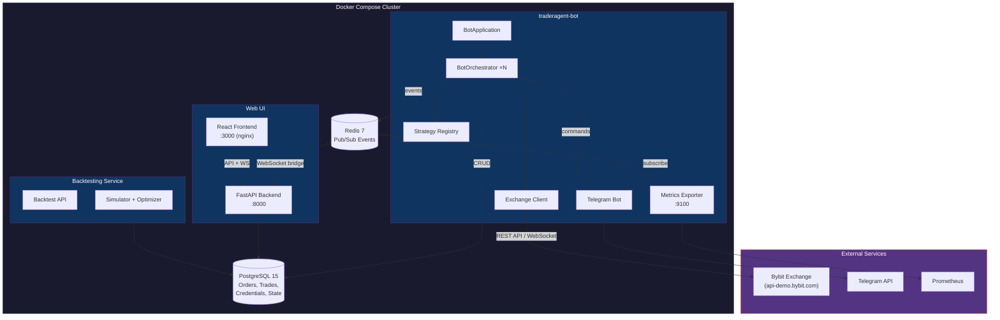

---

## 2. Directory Structure

```
TRADERAGENT/
├── bot/                            # Core trading bot
│   ├── main.py                     # Entry point — bootstraps everything
│   ├── api/                        # Exchange connectivity
│   │   ├── exchange_client.py      #   CCXT unified wrapper
│   │   ├── bybit_direct_client.py  #   Bybit V5 direct API (demo)
│   │   └── exceptions.py           #   Custom exchange errors
│   ├── config/                     # Configuration
│   │   ├── manager.py              #   YAML loader + hot reload
│   │   └── schemas.py              #   Pydantic validation models
│   ├── core/                       # Trading engines
│   │   ├── grid_engine.py          #   Grid order placement
│   │   ├── dca_engine.py           #   Dollar-cost averaging
│   │   └── risk_manager.py         #   Capital protection
│   ├── database/                   # Persistence layer
│   │   ├── manager.py              #   Async SQLAlchemy operations
│   │   ├── models.py               #   v1 schema (credentials, orders)
│   │   ├── models_v2.py            #   v2 schema (strategies, signals)
│   │   └── models_state.py         #   State snapshots
│   ├── orchestrator/               # Multi-strategy coordination
│   │   ├── bot_orchestrator.py     #   Main trading loop
│   │   ├── strategy_registry.py    #   Strategy lifecycle manager
│   │   ├── strategy_selector.py    #   Dynamic strategy selection
│   │   ├── events.py               #   Redis Pub/Sub event system
│   │   ├── health_monitor.py       #   Auto-restart on failure
│   │   └── state_persistence.py    #   Crash recovery
│   ├── strategies/                 # Strategy implementations
│   │   ├── base.py                 #   BaseStrategy ABC
│   │   ├── grid/                   #   Grid strategy (6 files)
│   │   ├── dca/                    #   DCA strategy (5 files)
│   │   ├── smc/                    #   Smart Money Concepts (5 files)
│   │   ├── trend_follower/         #   Trend follower (6 files)
│   │   ├── hybrid/                 #   Grid+DCA hybrid (2 files)
│   │   └── *_adapter.py            #   Adapters to BaseStrategy
│   ├── telegram/bot.py             # Telegram control & alerts
│   └── monitoring/                 # Prometheus metrics + alerts
├── web/                            # Web dashboard
│   ├── backend/                    #   FastAPI (42 routes + WS)
│   └── frontend/                   #   React + TypeScript (7 pages)
├── services/backtesting/           # Backtesting microservice
├── configs/                        # YAML configurations
├── tests/                          # 1884 tests (100% pass rate)
├── alembic/                        # DB migrations
├── docker-compose.yml              # Production deployment
└── Dockerfile
```

---

## 3. Bot Lifecycle

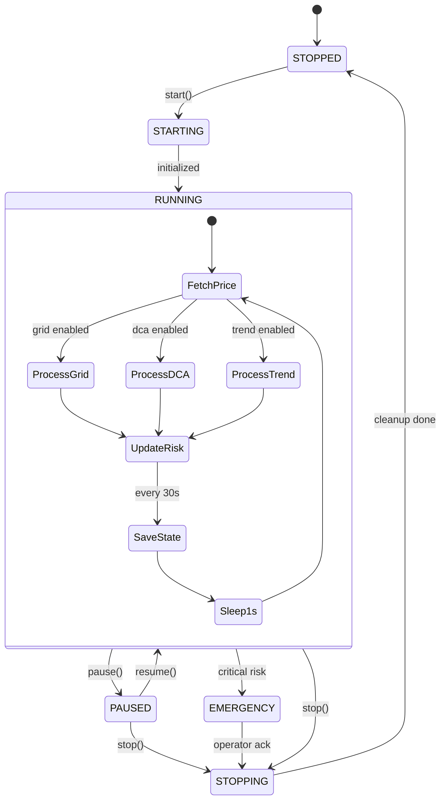

---

## 4. Strategy Architecture

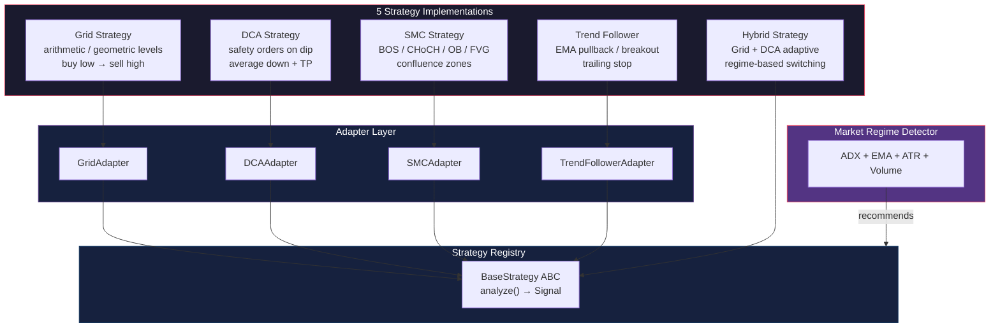

### Strategy Selection by Market Regime

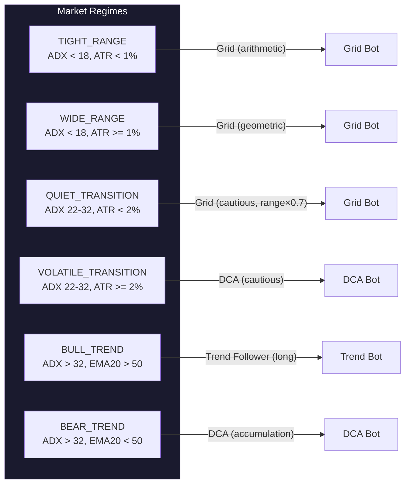

---

## 5. Data Flow

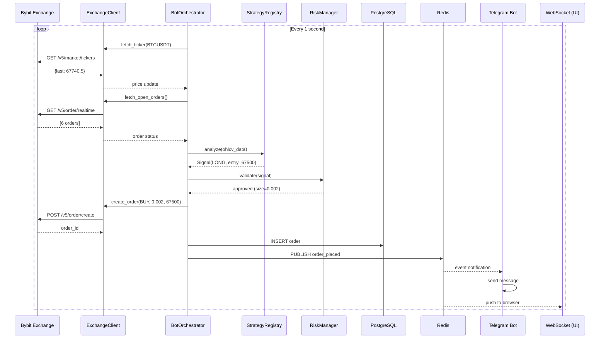

---

## 6. Database Schema

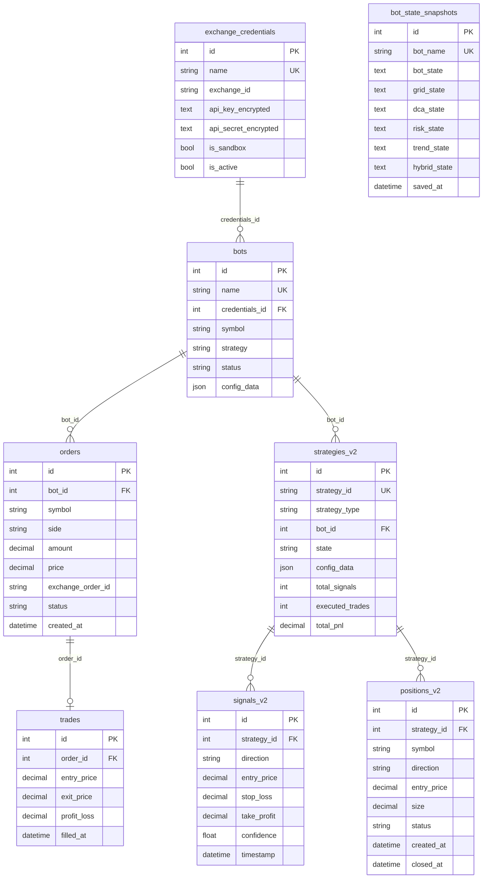

---

## 7. Exchange Integration

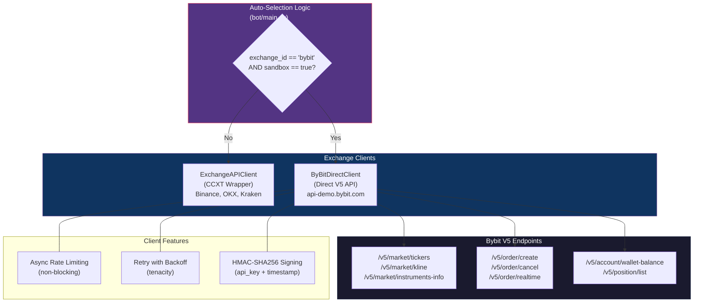

---

## 8. Event System

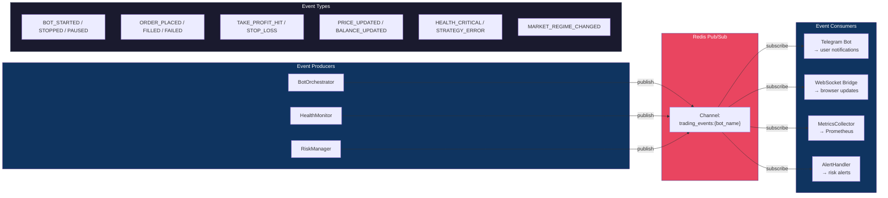

---

## 9. Web UI Architecture

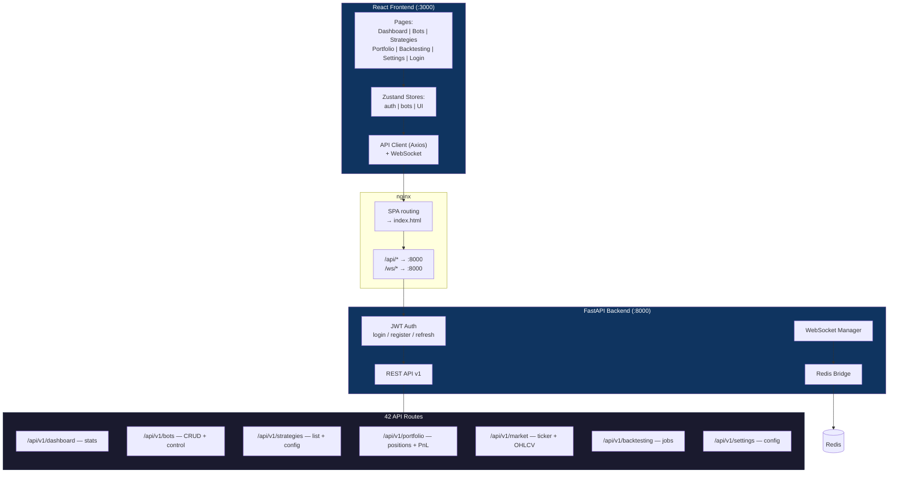

---

## 10. Deployment Architecture

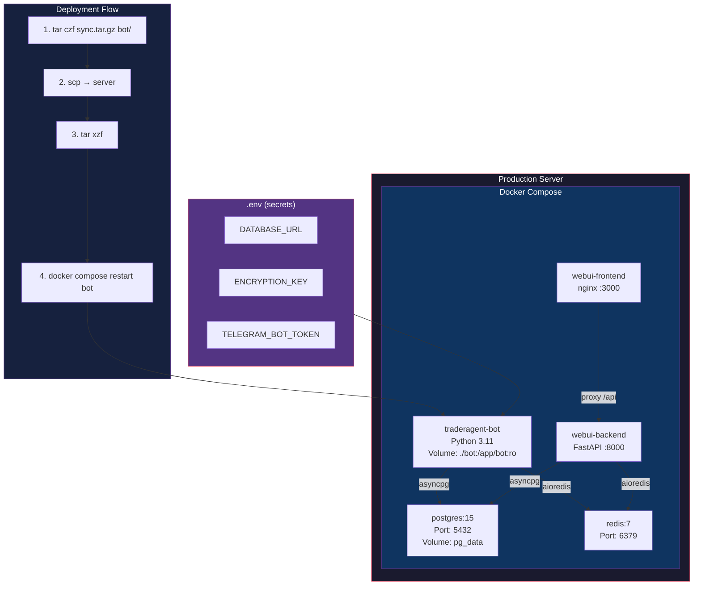

---

## 11. Backtesting System

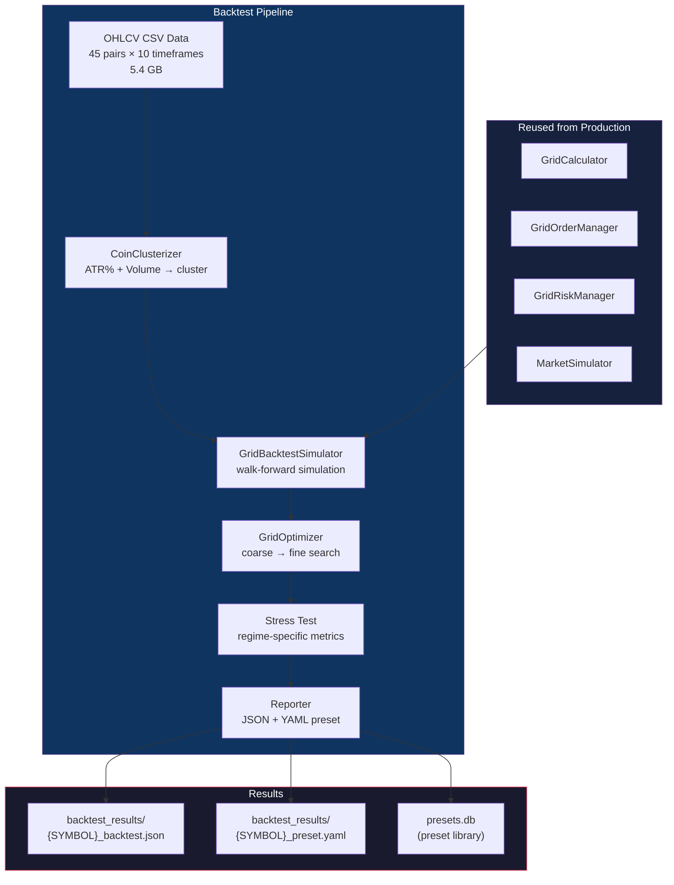

---

## 12. State Persistence & Crash Recovery

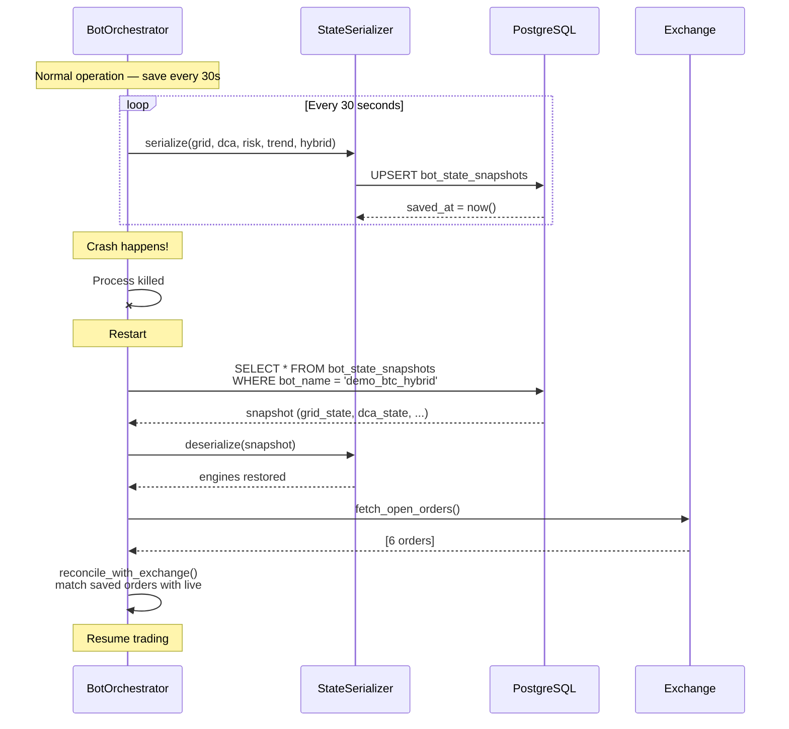

---

## 13. Security Model

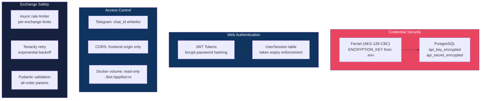

---

## 14. Strategy Capabilities Matrix

| Strategy | Entry Logic | Exit Logic | Risk Management | Best Market |
|:---------|:-----------|:-----------|:----------------|:------------|
| **Grid** | Price hits grid level | Counter-order at next level | Max position size, stop-loss | Sideways / Range |
| **DCA** | Price drops N% from entry | Take profit at avg + M% | Max steps, daily loss limit | Dips / Bear market |
| **Trend Follower** | EMA pullback / breakout | Trailing stop, ATR-based TP | 1-2% risk per trade | Trending market |
| **SMC** | Confluence zone + pattern | Dynamic SL/TP, partial close | Kelly criterion sizing | Price action setups |
| **Hybrid** | Grid in range, DCA on breakout | Context-dependent | Combined limits | Mixed / Uncertain |

---

## 15. Monitoring Stack

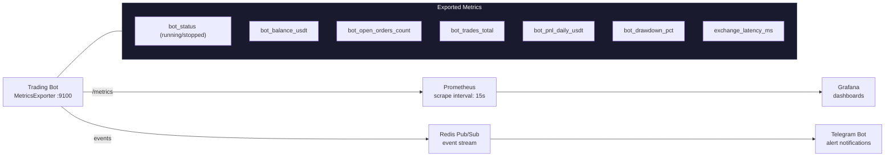

---

## 16. Testing Architecture

```
Total: 1884 tests | Pass rate: 100% (1859 passed, 25 skipped)
```

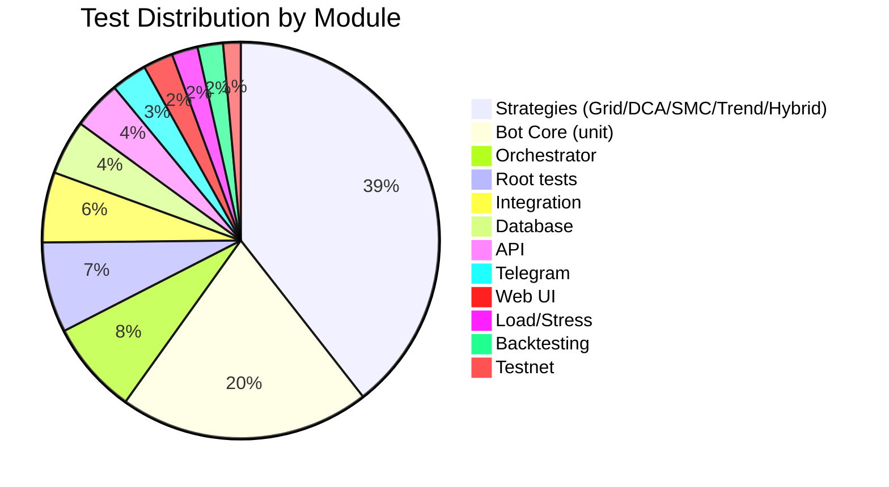

---

## 17. Configuration Example

```yaml
# configs/phase7_demo.yaml
database_url: ${DATABASE_URL}
log_level: INFO
encryption_key: ${ENCRYPTION_KEY}
telegram_bot_token: ${TELEGRAM_BOT_TOKEN}
telegram_chat_id: ${TELEGRAM_CHAT_ID}

bots:
  - name: demo_btc_hybrid
    symbol: BTC/USDT
    strategy: hybrid
    exchange:
      exchange_id: bybit
      credentials_name: bybit_demo
      sandbox: true              # → api-demo.bybit.com

    grid:
      enabled: true
      upper_price: "72000"
      lower_price: "65000"
      grid_levels: 6
      amount_per_grid: "150"
      profit_per_grid: "0.012"

    dca:
      enabled: true
      trigger_percentage: "0.04"
      amount_per_step: "150"
      max_steps: 4
      take_profit_percentage: "0.08"

    risk_management:
      max_position_size: "3000"
      stop_loss_percentage: "0.12"
      max_daily_loss: "600"

    dry_run: false
    auto_start: true
```

---

## 18. Key Design Decisions

| Decision | Rationale |
|:---------|:----------|
| **ByBitDirectClient** instead of CCXT sandbox | CCXT `set_sandbox_mode(True)` routes to `testnet.bybit.com` (wrong). Demo trading requires `api-demo.bybit.com` |
| **Linear futures only** for demo | Bybit demo does not support spot trading |
| **Adapter pattern** for strategies | Unified `BaseStrategy` interface lets `StrategyRegistry` manage all types uniformly |
| **Redis Pub/Sub** for events | Decouples producers (bot) from consumers (Telegram, Web UI, monitoring) |
| **Read-only volume mount** | `./bot:/app/bot:ro` — code changes via tar/scp, no Docker rebuild needed |
| **State snapshots** every 30s | Crash recovery without losing grid/DCA/risk state |
| **asyncpg** (not psycopg2) | Native async PostgreSQL driver — no thread pool overhead |
| **Fernet encryption** for API keys | AES-128-CBC, keys never stored in plaintext |
| **SMC as filter, not strategy** | Filters only ENTRY signals; exit/SL/TP/grid-counter bypass SMC |
| **HYBRID removed** in v2.0 design | Function moved to Strategy Router — eliminates double routing |

---

## 19. v2.0 Algorithm Architecture (Planned)

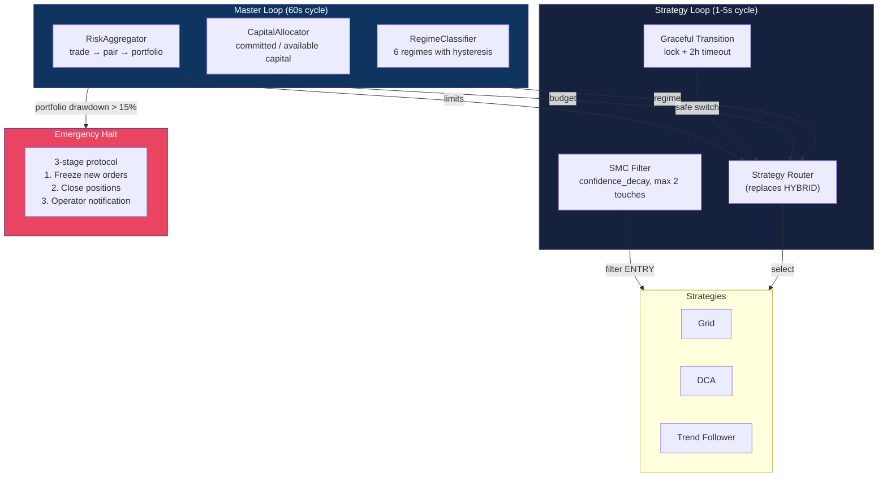

---

## 20. Quick Reference

```bash
# Run ALL tests (1884)
python -m pytest bot/tests/ tests/ --ignore=bot/tests/testnet -q

# Deploy code to server
tar czf /tmp/sync.tar.gz bot/ && \
scp /tmp/sync.tar.gz ai-agent@185.233.200.13:/tmp/ && \
ssh ai-agent@185.233.200.13 "cd ~/TRADERAGENT && tar xzf /tmp/sync.tar.gz"

# Restart bot
ssh ai-agent@185.233.200.13 "cd ~/TRADERAGENT && docker compose restart bot"

# View logs
ssh ai-agent@185.233.200.13 "docker logs traderagent-bot --since 5m"

# Start web UI
docker compose up webui-backend webui-frontend

# Run backtesting
docker compose run --rm bot python scripts/run_grid_backtest_all.py \
  --data-dir /app/data/historical --symbols BTC,ETH,SOL
```

---

> **Last updated:** February 20, 2026 | **Session:** 15 | **Commit:** `7d84e8d`
> **Co-Authored:** Claude Opus 4.6
