# ARCHITECTURE — TRADERAGENT v2.2

> Autonomous multi-strategy cryptocurrency trading platform
> Stack: Python 3.12 | asyncio | PostgreSQL | Redis | FastAPI | React | Docker
> Updated: February 22, 2026 | 478 commits | 205 files | 62,300 LOC | 1,576 tests

---

## 1. System Overview

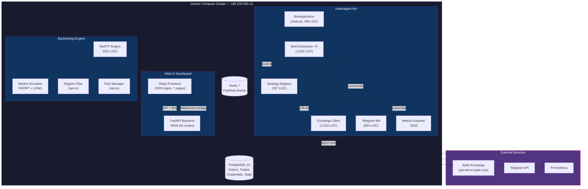

---

## 2. Directory Structure

```
TRADERAGENT/                          478 commits, 62,300 LOC
├── bot/                              Core trading bot
│   ├── main.py                       Entry point — bootstraps everything (339 LOC)
│   ├── api/                          Exchange connectivity (1,813 LOC)
│   │   ├── exchange_client.py          CCXT unified wrapper (671 LOC)
│   │   ├── bybit_direct_client.py      Bybit V5 direct API for demo (1,014 LOC)
│   │   └── exceptions.py               Custom exchange errors
│   ├── config/                       Configuration
│   │   ├── manager.py                  YAML loader + env substitution
│   │   └── schemas.py                  Pydantic validation models (454 LOC)
│   ├── core/                         Trading engines
│   │   ├── grid_engine.py              Grid order placement
│   │   ├── dca_engine.py               Dollar-cost averaging
│   │   └── risk_manager.py             Capital protection (384 LOC)
│   ├── database/                     Persistence layer
│   │   ├── manager.py                  Async SQLAlchemy operations
│   │   ├── models.py                   v1 schema (credentials, orders)
│   │   ├── models_v2.py                v2 schema (strategies, signals, positions)
│   │   └── models_state.py             State snapshots
│   ├── orchestrator/                 Multi-strategy coordination (3,990 LOC)
│   │   ├── bot_orchestrator.py         Main trading loop (1,622 LOC)
│   │   ├── strategy_registry.py        Strategy lifecycle manager (357 LOC)
│   │   ├── strategy_selector.py        Dynamic strategy selection (469 LOC)
│   │   ├── market_regime.py            ADX/EMA/ATR regime detection (693 LOC)
│   │   ├── events.py                   Redis Pub/Sub event system (154 LOC)
│   │   ├── health_monitor.py           Auto-restart on failure (330 LOC)
│   │   └── state_persistence.py        Crash recovery (365 LOC)
│   ├── strategies/                   5 strategy families (33 files, ~7,000 LOC)
│   │   ├── base.py                     BaseStrategy ABC (325 LOC)
│   │   ├── grid/                       Grid strategy (6 files)
│   │   ├── dca/                        DCA strategy (8 files)
│   │   ├── smc/                        Smart Money Concepts (7 files, 2,466 LOC)
│   │   ├── trend_follower/             Trend follower (8 files)
│   │   ├── hybrid/                     Grid+DCA hybrid (4 files)
│   │   ├── grid_adapter.py             Grid → BaseStrategy (281 LOC)
│   │   ├── dca_adapter.py              DCA → BaseStrategy (306 LOC)
│   │   ├── smc_adapter.py              SMC → BaseStrategy (308 LOC)
│   │   └── trend_follower_adapter.py   TF → BaseStrategy (310 LOC)
│   ├── telegram/bot.py               Telegram control & alerts (844 LOC)
│   ├── monitoring/                   Prometheus metrics + alerts
│   └── tests/backtesting/            Backtesting engine (24 files, 8,727 LOC)
├── web/                              Web dashboard
│   ├── backend/                        FastAPI (42 routes + WebSocket)
│   └── frontend/                       React + TypeScript (7 pages)
├── tests/                            Test suite (1,576 tests)
├── configs/phase7_demo.yaml          5 bots: Hybrid, Grid, DCA, Trend, SMC
├── alembic/                          DB migrations
├── docker-compose.yml                Production deployment
└── Dockerfile
```

---

## 3. Bot Lifecycle

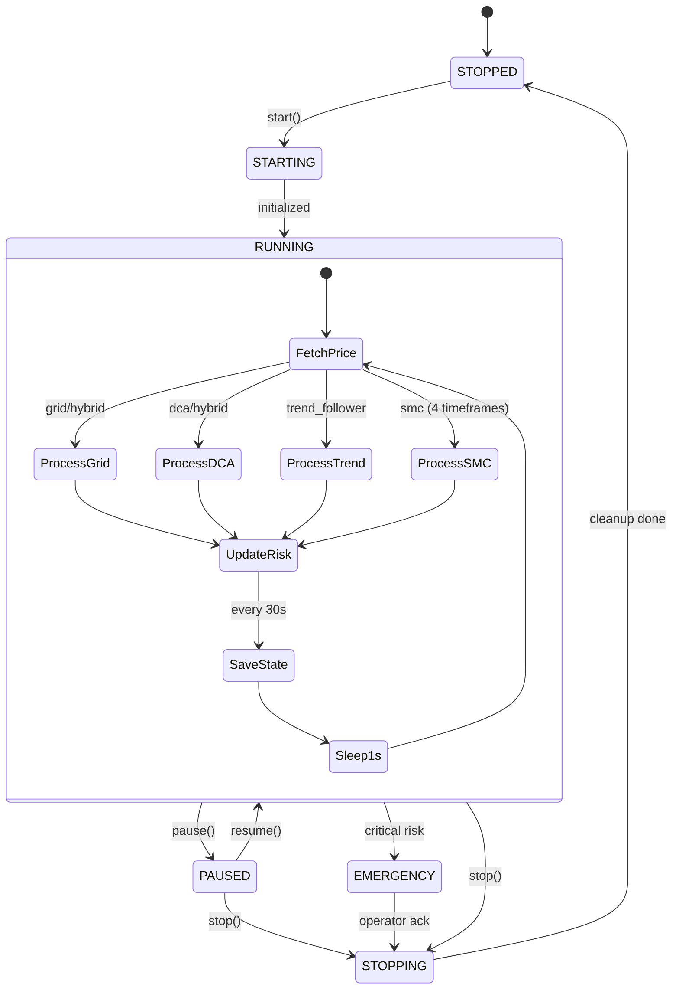

---

## 4. Strategy Architecture

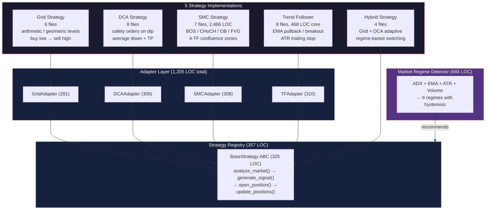

### Unified Signal Interface

```python
@dataclass
class BaseSignal:
    direction: SignalDirection    # LONG | SHORT
    entry_price: Decimal
    stop_loss: Decimal
    take_profit: Decimal
    confidence: float            # 0.0 — 1.0
    timestamp: datetime
    strategy_type: str           # "grid" | "dca" | "smc" | "trend_follower"
    metadata: dict[str, Any]     # strategy-specific data
```

### Strategy Selection by Market Regime

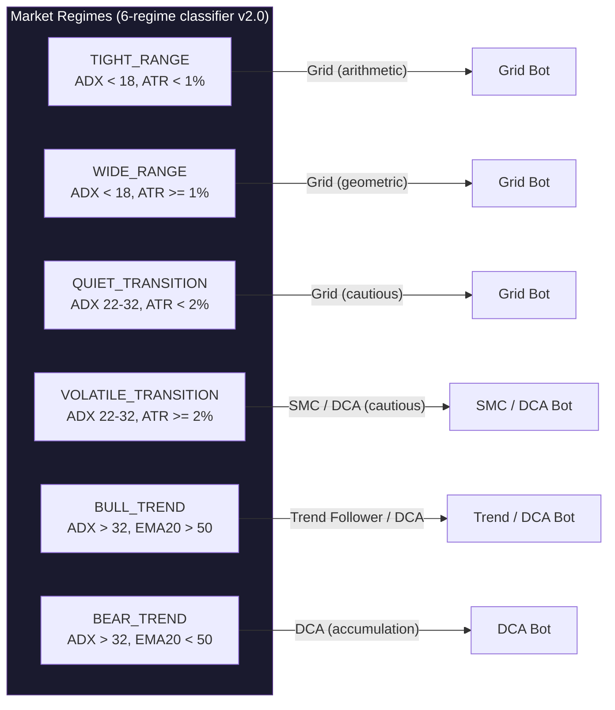

### Regime → Strategy Type Mapping (used in both production and backtester)

| Regime | Allowed Strategy Types | Recommended |
|:-------|:----------------------|:------------|
| `TIGHT_RANGE` | `grid` | Grid (arithmetic) |
| `WIDE_RANGE` | `grid` | Grid (geometric) |
| `QUIET_TRANSITION` | `grid` | Grid (cautious) |
| `VOLATILE_TRANSITION` | `smc` | SMC / Reduce Exposure |
| `BULL_TREND` | `trend_follower`, `dca` | DCA |
| `BEAR_TREND` | `dca`, `trend_follower` | DCA |
| `UNKNOWN` | *(none)* | Hold |

---

## 5. SMC Strategy Pipeline

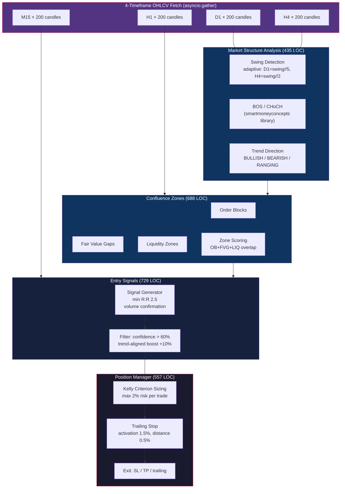

---

## 6. Data Flow

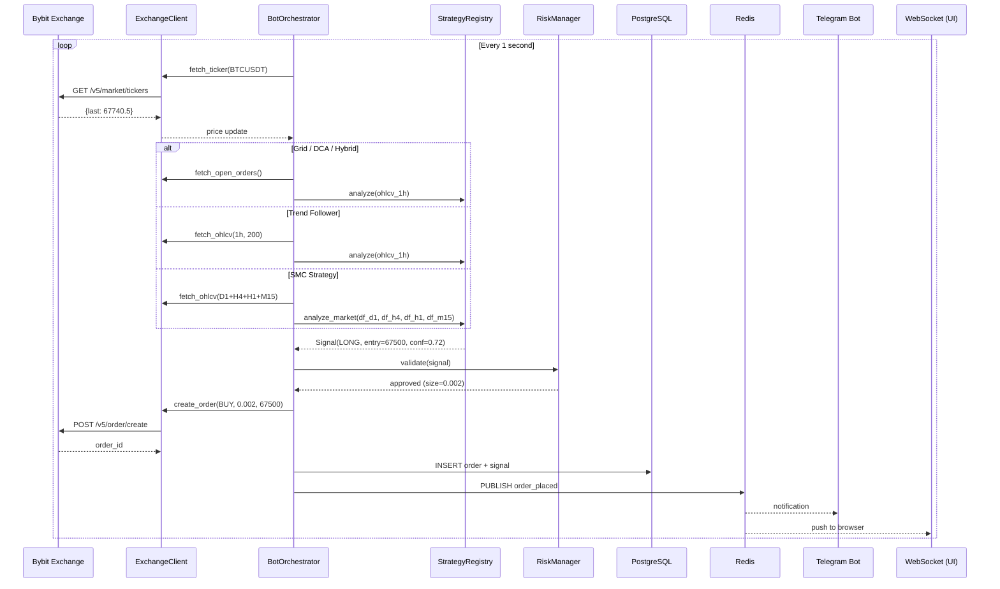

---

## 7. Database Schema

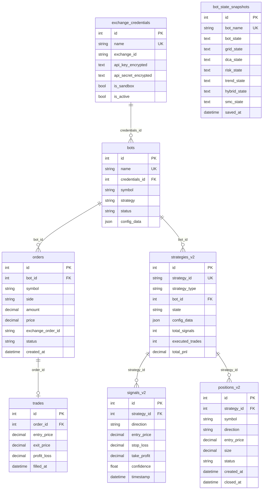

---

## 8. Exchange Integration

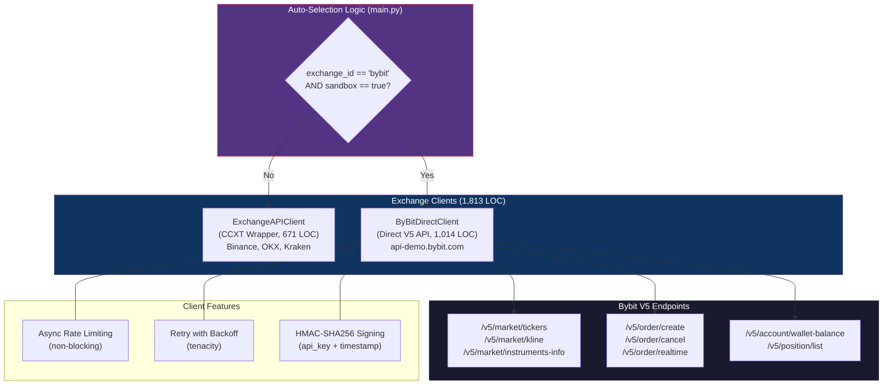

---

## 9. Multi-Timeframe Backtesting Engine

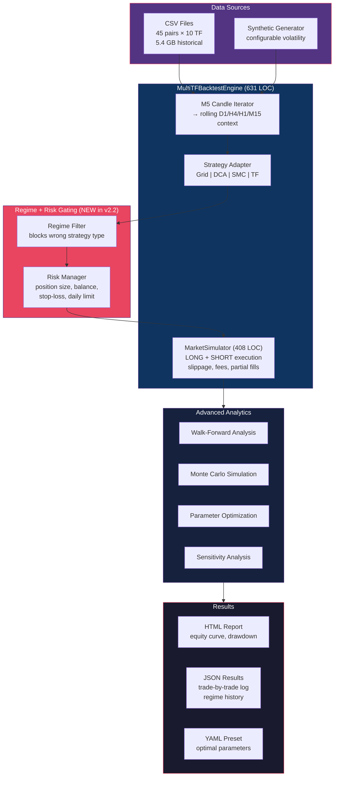

### Backtester Signal Execution Pipeline (NEW in v2.2)

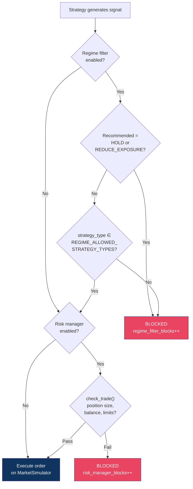

### Backtesting Configuration

```python
@dataclass
class MultiTFBacktestConfig:
    # Core
    symbol: str = "BTC/USDT"
    initial_balance: Decimal = Decimal("10000")
    warmup_bars: int = 50
    risk_per_trade: Decimal = Decimal("0.02")

    # Regime filtering (opt-in, NEW in v2.2)
    enable_regime_filter: bool = False
    regime_check_interval: int = 12      # every N M5 bars (12 = 1h)
    regime_timeframe: str = "h1"         # h1 | h4 | d1

    # Risk management (opt-in, NEW in v2.2)
    enable_risk_manager: bool = False
    rm_max_position_size: Decimal = Decimal("5000")
    rm_min_order_size: Decimal = Decimal("10")
    rm_stop_loss_percentage: Decimal | None = None   # e.g. 0.1 = 10%
    rm_max_daily_loss: Decimal | None = None
    rm_daily_loss_reset_bars: int = 288              # 288 M5 bars = 24h
```

### Backtesting Capabilities

| Feature | Status |
|:--------|:-------|
| Multi-timeframe (M5 → D1) | DONE |
| LONG positions | DONE |
| SHORT positions (futures) | DONE |
| CSV data loading | DONE |
| Synthetic data generation | DONE |
| Walk-forward analysis | DONE |
| Monte Carlo simulation | DONE |
| HTML report generation | DONE |
| All 5 strategies supported | DONE |
| **Regime filtering (opt-in)** | **DONE (v2.2)** |
| **Risk manager gating (opt-in)** | **DONE (v2.2)** |
| **Regime tracking in results** | **DONE (v2.2)** |

### Backtester Result Enrichment (NEW in v2.2)

```python
@dataclass
class BacktestResult:
    # ... existing performance, trade, risk metric fields ...

    # Regime tracking (NEW in v2.2)
    regime_history: list[dict]     # [{bar, regime, confidence, recommended}, ...]
    regime_changes: int            # number of regime transitions
    regime_filter_blocks: int      # signals blocked by regime filter

    # Risk management tracking (NEW in v2.2)
    risk_manager_blocks: int       # signals blocked by risk manager
    risk_halted: bool              # did risk manager halt the backtest?
    risk_halt_reason: str | None   # "stop_loss" | "daily_loss" | None
```

---

## 10. Event System

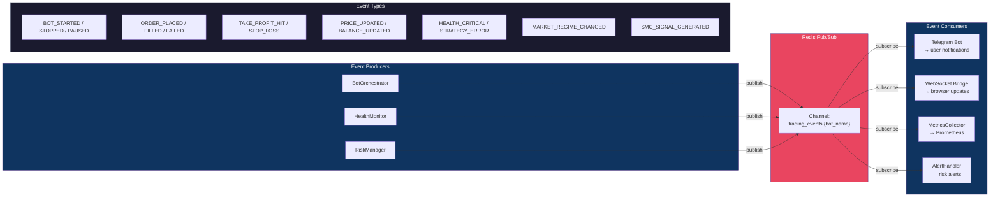

---

## 11. Web UI Architecture

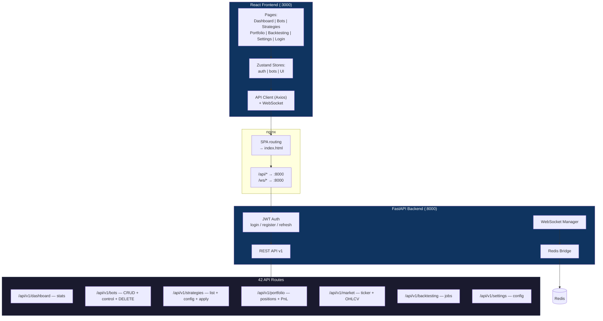

---

## 12. State Persistence & Crash Recovery

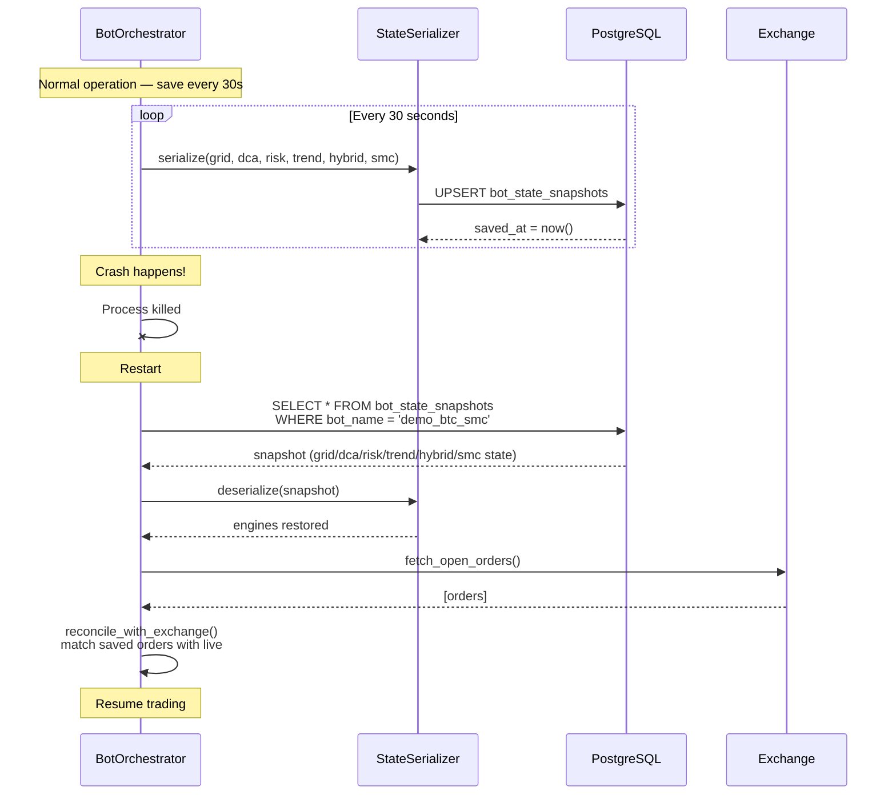

---

## 13. Deployment Architecture

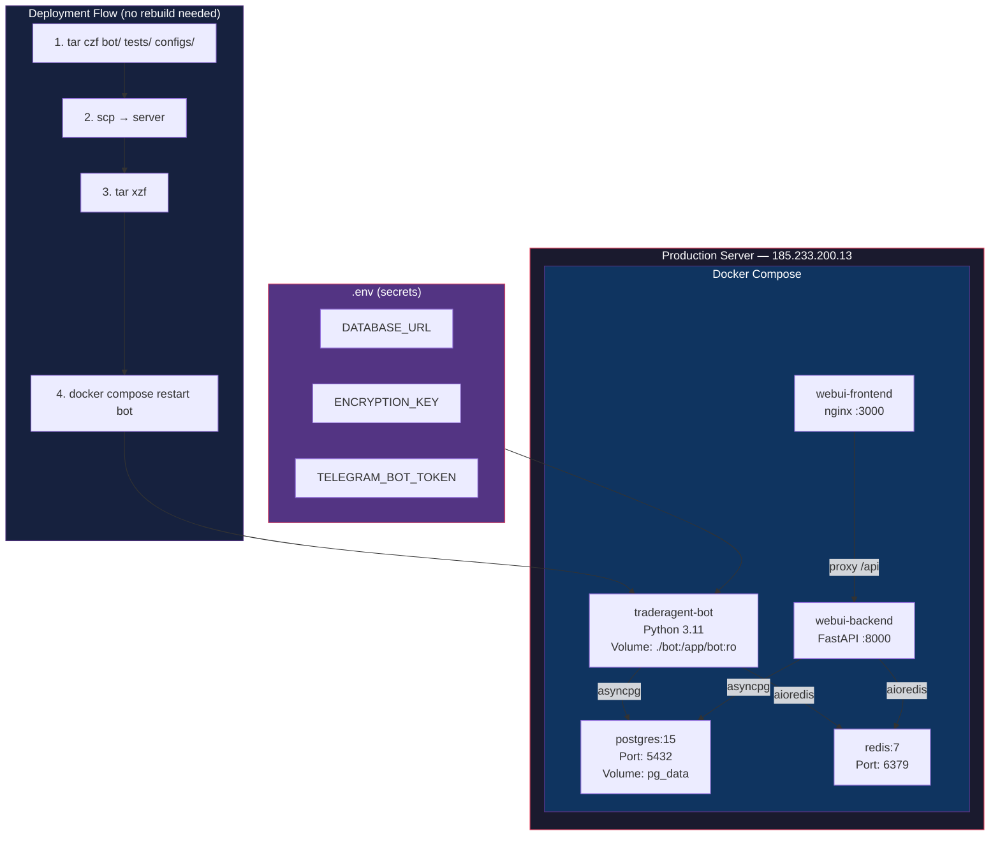

---

## 14. Security Model

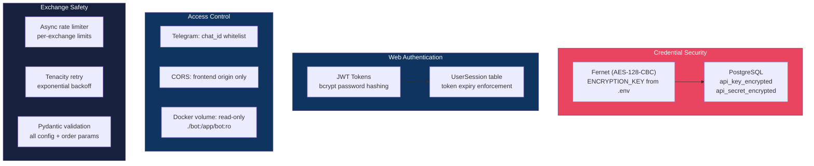

---

## 15. Strategy Capabilities Matrix

| Strategy | Entry Logic | Exit Logic | Risk Management | Timeframes | Best Market |
|:---------|:-----------|:-----------|:----------------|:-----------|:------------|
| **Grid** | Price hits grid level | Counter-order at next level | Max position, stop-loss | 1h | Sideways / Range |
| **DCA** | Price drops N% from entry | Take profit at avg + M% | Max steps, daily loss | 1h | Dips / Bear |
| **Trend Follower** | EMA pullback / breakout | Trailing stop, ATR-based TP | 1-2% risk per trade | 1h | Trending |
| **SMC** | Confluence zone + BOS/CHoCH | Dynamic SL/TP, trailing | Kelly criterion, max 3 pos | D1+H4+H1+M15 | Price action |
| **Hybrid** | Grid in range, DCA on breakout | Context-dependent | Combined limits | 1h | Mixed |

---

## 16. Testing Architecture

```
Total: 1,576 tests | Pass rate: 100% (1,551 passed, 25 skipped)
```

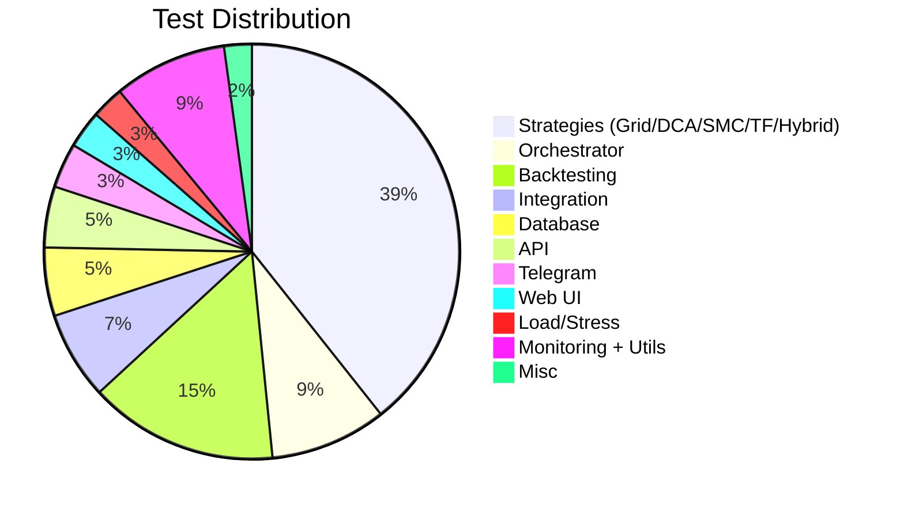

### Backtesting Test Coverage (v2.2)

| Test Suite | Tests | Description |
|:-----------|------:|:------------|
| `test_multi_tf_backtesting.py` | 54 | Core engine, data loading, SHORT/LONG, analytics |
| `test_smc_backtest.py` | 15 | SMC strategy-specific backtest |
| `test_regime_risk_integration.py` | 21 | Regime filter + risk manager integration |
| `test_backtesting.py` | 14 | Original backtesting engine |
| Other backtesting tests | 128 | Walk-forward, Monte Carlo, HTML reports, etc. |
| **Total backtesting** | **232** | |

---

## 17. Deployed Configuration

```yaml
# configs/phase7_demo.yaml — 5 bots on Bybit Demo
bots:
  - name: demo_btc_hybrid     # BTC/USDT, Grid+DCA, auto_start: true
  - name: demo_eth_grid        # ETH/USDT, Grid only, manual start
  - name: demo_sol_dca         # SOL/USDT, DCA only, manual start
  - name: demo_btc_trend       # BTC/USDT, Trend Follower, manual start
  - name: demo_btc_smc         # BTC/USDT, SMC, dry_run: true, manual start
```

---

## 18. Key Design Decisions

| Decision | Rationale |
|:---------|:----------|
| **ByBitDirectClient** vs CCXT sandbox | CCXT `set_sandbox_mode(True)` routes to testnet (wrong). Demo requires `api-demo.bybit.com` |
| **Linear futures only** | Bybit demo does not support spot trading |
| **Adapter pattern** for strategies | Unified `BaseStrategy` interface lets registry manage all types uniformly |
| **Redis Pub/Sub** for events | Decouples producers from consumers (Telegram, Web UI, monitoring) |
| **Read-only volume mount** | `./bot:/app/bot:ro` — code changes via tar/scp, no Docker rebuild |
| **State snapshots** every 30s | Crash recovery without losing grid/DCA/risk/SMC state |
| **asyncpg** (not psycopg2) | Native async PostgreSQL driver — no thread pool overhead |
| **Fernet encryption** for API keys | AES-128-CBC, keys never stored in plaintext |
| **Adaptive swing_length** for SMC | D1: swing//5 (10), H4: swing//2 (25) — works with 50 daily candles |
| **Kelly criterion** for SMC sizing | Optimal position sizing based on win rate and payoff ratio |
| **smartmoneyconcepts library** | Battle-tested BOS/CHoCH/OB/FVG detection vs custom implementation |
| **6-regime classifier v2.0** | ADX hysteresis prevents flip-flopping between regimes |
| **Opt-in regime/risk in backtester** | `enable_regime_filter=False` + `enable_risk_manager=False` by default — existing tests unaffected |

---

## 19. Monitoring Stack

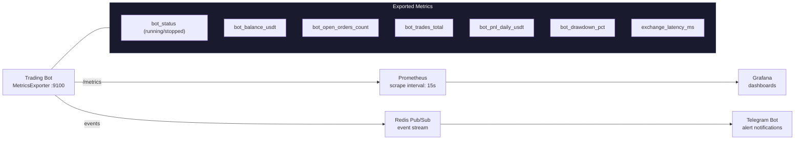

---

## 20. Quick Reference

```bash
# Run ALL tests (1,576)
python -m pytest tests/ bot/tests/ -q

# Run backtesting tests only (232)
python -m pytest bot/tests/backtesting/ -v

# Lint check
python -m ruff check bot/ tests/
python -m black --check bot/ tests/
python -m mypy bot/ --ignore-missing-imports

# Deploy code to server
tar czf /tmp/sync.tar.gz bot/ tests/ configs/ && \
scp /tmp/sync.tar.gz ai-agent@185.233.200.13:/tmp/ && \
ssh ai-agent@185.233.200.13 "cd ~/TRADERAGENT && tar xzf /tmp/sync.tar.gz"

# Restart bot
ssh ai-agent@185.233.200.13 "cd ~/TRADERAGENT && docker compose restart bot"

# View logs
ssh ai-agent@185.233.200.13 "docker logs traderagent-bot --since 5m"

# SMC bot logs
ssh ai-agent@185.233.200.13 "docker logs traderagent-bot 2>&1 | grep smc"

# Start/stop bot via Telegram
/start_bot demo_btc_smc
/stop_bot demo_btc_smc

# Run backtesting
python bot/tests/backtesting/multi_tf_engine.py --strategy smc --symbol BTCUSDT
```

---

## Changelog: v2.1 → v2.2

| Change | Details |
|:-------|:--------|
| **Regime filter in backtester** | Opt-in `enable_regime_filter=True` — blocks signals when strategy type doesn't match current market regime. Uses same `REGIME_ALLOWED_STRATEGY_TYPES` mapping as production `strategy_selector.py` |
| **Risk manager in backtester** | Opt-in `enable_risk_manager=True` — validates position size, balance, portfolio stop-loss, daily loss limit. Halts backtest when limits exceeded |
| **HOLD / REDUCE_EXPOSURE blocking** | When regime recommends HOLD or REDUCE_EXPOSURE, all new entries blocked |
| **Regime tracking in results** | `BacktestResult` enriched with `regime_history`, `regime_changes`, `regime_filter_blocks` |
| **Risk tracking in results** | `BacktestResult` enriched with `risk_manager_blocks`, `risk_halted`, `risk_halt_reason` |
| **Regime in equity curve** | Each equity curve entry includes current regime value when regime filter is active |
| **BacktestResult.to_dict()** | New `regime_tracking` and `risk_management` sections in JSON output |
| **21 integration tests** | `test_regime_risk_integration.py` — regime detection, filtering, risk blocking, combined, output fields |
| **Backtesting LOC** | 415 → 631 LOC (engine), 8,727 LOC total (24 files) |
| **Test count** | 1,534 → 1,576 (+42 new tests, 232 backtesting) |

---

## Changelog: v2.0 → v2.1

| Change | Details |
|:-------|:--------|
| **SMC standalone strategy** | Full deployment pipeline: Pydantic schema, orchestrator integration, 4-TF OHLCV fetch, entry/exit execution |
| **Adaptive swing_length** | D1: swing//5, H4: swing//2 — no longer needs 101 daily candles |
| **Multi-TF backtesting** | SHORT positions, M5 timeframe, CSV loading, CLI runner |
| **Bot management dashboard** | Create/delete bots, PnL charts, strategy templates, loading indicators |
| **CI fixes** | mypy 0 errors, pandas>=2.1.0 for Python 3.12, types-PyYAML |
| **Lint cleanup** | ruff + black 0 errors across bot/ and tests/ |
| **5 deployed bots** | Hybrid, Grid, DCA, Trend Follower, SMC (dry_run) |
| **Test count** | 1,504 → 1,534 (+30 new tests) |

---

> **Last updated:** February 22, 2026 | **Session:** 21 | **Commit:** `ff6ed2b`
> **Co-Authored:** Claude Opus 4.6
