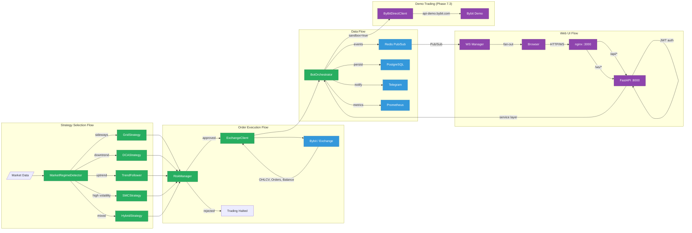

# TRADERAGENT v2.0 — Architecture & Implementation Status

**Updated:** 2026-02-16 | **Tests:** 510 passed (100%) | **Release:** v2.0.0 | **Demo Trading:** LIVE on Bybit | **Web UI:** COMPLETE | **Load Testing:** COMPLETE | **Grid Backtesting:** COMPLETE

> Legend: `[DONE]` — implemented & tested | `[TODO]` — not started

---

## System Architecture Diagram

```mermaid
graph TB
    subgraph UI["<b>USER INTERFACE LAYER</b>"]
        direction LR
        TG["🟢 Telegram Bot<br/><i>bot/telegram/bot.py</i><br/>860 lines<br/><b>[DONE]</b>"]
        WEBUI["🟢 Web UI Dashboard<br/><i>React + FastAPI + WebSocket</i><br/>42 API routes, 7 pages<br/><b>[DONE]</b>"]
    end

    subgraph ORCH["<b>ORCHESTRATION LAYER</b> — Phase 1 🟢"]
        direction LR
        BO["🟢 BotOrchestrator<br/><i>orchestrator/bot_orchestrator.py</i><br/>~1200 lines<br/><b>[DONE]</b>"]
        SS["🟢 StrategySelector<br/><i>orchestrator/strategy_selector.py</i><br/>475 lines<br/><b>[DONE]</b>"]
        MR["🟢 MarketRegime<br/><i>orchestrator/market_regime.py</i><br/><b>[DONE]</b>"]
        SR["🟢 StrategyRegistry<br/><i>orchestrator/strategy_registry.py</i><br/><b>[DONE]</b>"]
        EV["🟢 Events<br/><i>orchestrator/events.py</i><br/><b>[DONE]</b>"]
        HM["🟢 HealthMonitor<br/><i>orchestrator/health_monitor.py</i><br/><b>[DONE]</b>"]
    end

    subgraph STRAT["<b>STRATEGIES LAYER</b> — Phases 1-4 🟢"]
        direction TB

        subgraph GRID["Phase 2: Grid Trading 🟢"]
            direction LR
            GC["🟢 GridCalculator<br/>577 lines"]
            GOM["🟢 GridOrderManager<br/>557 lines"]
            GRM["🟢 GridRiskManager<br/>520 lines"]
            GA["🟢 GridAdapter"]
        end

        subgraph DCA["Phase 3: DCA Engine 🟢"]
            direction LR
            DSG["🟢 DCASignalGenerator<br/>638 lines"]
            DPM["🟢 DCAPositionManager<br/>678 lines"]
            DRM["🟢 DCARiskManager<br/>610 lines"]
            DE["🟢 DCAEngine<br/>440 lines"]
            DTS["🟢 DCATrailingStop"]
            DA["🟢 DCAAdapter"]
        end

        subgraph HYBRID["Phase 4: Hybrid 🟢"]
            direction LR
            HS["🟢 HybridStrategy<br/>456 lines"]
            MRD["🟢 MarketRegimeDetector<br/>650 lines"]
        end

        subgraph SMC["SMC Strategy 🟢"]
            direction LR
            SMS["🟢 SMCStrategy<br/>323 lines"]
            CZ["🟢 ConfluenceZones<br/>604 lines"]
            ES["🟢 EntrySignals<br/>676 lines"]
            MS["🟢 MarketStructure<br/>436 lines"]
            SPM["🟢 PositionManager<br/>557 lines"]
            SA["🟢 SMCAdapter"]
        end

        subgraph TF["Trend Follower 🟢"]
            direction LR
            TFS["🟢 TFStrategy<br/>468 lines"]
            MA["🟢 MarketAnalyzer<br/>316 lines"]
            EL["🟢 EntryLogic<br/>447 lines"]
            TPM["🟢 PositionManager<br/>436 lines"]
            TRM["🟢 RiskManager<br/>409 lines"]
            TFA["🟢 TFAdapter"]
        end

        BS["🟢 BaseStrategy<br/><i>strategies/base.py</i><br/>329 lines"]
    end

    subgraph GRIDBT["<b>GRID BACKTESTING</b> — COMPLETE 🟢"]
        direction LR
        GBS["🟢 GridBacktestSimulator<br/><i>backtesting/grid/simulator.py</i><br/>415 lines"]
        GBC["🟢 CoinClusterizer<br/><i>backtesting/grid/clusterizer.py</i><br/>157 lines"]
        GBO["🟢 GridOptimizer<br/><i>backtesting/grid/optimizer.py</i><br/>393 lines"]
        GBR["🟢 GridBacktestReporter<br/><i>backtesting/grid/reporter.py</i><br/>164 lines"]
        GBSYS["🟢 GridBacktestSystem<br/><i>backtesting/grid/system.py</i><br/>250 lines"]
    end

    subgraph CORE["<b>CORE LAYER</b>"]
        direction LR
        GE["🟢 GridEngine<br/><i>core/grid_engine.py</i><br/><b>[DONE]</b>"]
        DCE["🟢 DCAEngine<br/><i>core/dca_engine.py</i><br/><b>[DONE]</b>"]
        RM["🟢 RiskManager<br/><i>core/risk_manager.py</i><br/><b>[DONE]</b>"]
    end

    subgraph INFRA["<b>INFRASTRUCTURE LAYER</b> — Phase 5 🟢"]
        direction LR

        subgraph EXCHANGE["Exchange API 🟢"]
            EC["🟢 ExchangeClient<br/><i>api/exchange_client.py</i><br/>671 lines — CCXT"]
            BD["🟢 BybitDirectClient<br/><i>api/bybit_direct_client.py</i><br/>~900 lines — Demo Trading"]
        end

        subgraph DB["Database 🟢"]
            DBM["🟢 DatabaseManager<br/><i>database/manager.py</i><br/>401 lines"]
            MOD["🟢 Models<br/><i>database/models.py</i>"]
            MIG["🟢 Migrations<br/><i>database/migrations.py</i>"]
            BKP["🟢 Backup<br/><i>database/backup.py</i>"]
        end

        subgraph MON["Monitoring 🟢"]
            ME["🟢 MetricsExporter<br/><i>monitoring/metrics_exporter.py</i><br/>252 lines"]
            MC["🟢 MetricsCollector<br/><i>monitoring/metrics_collector.py</i>"]
            AH["🟢 AlertHandler<br/><i>monitoring/alert_handler.py</i><br/>174 lines"]
        end

        subgraph CFG["Config 🟢"]
            CM["🟢 ConfigManager<br/><i>config/manager.py</i>"]
            CS["🟢 ConfigSchemas<br/><i>config/schemas.py</i>"]
            CV["🟢 ConfigValidator<br/><i>utils/config_validator.py</i>"]
        end

        subgraph UTIL["Utils 🟢"]
            LOG["🟢 Logger<br/><i>utils/logger.py</i>"]
            CAP["🟢 CapitalManager<br/><i>utils/capital_manager.py</i>"]
            SEC["🟢 SecurityAudit<br/><i>utils/security_audit.py</i>"]
        end
    end

    subgraph WEBSTACK["<b>WEB UI LAYER</b> — COMPLETE 🟢"]
        direction LR

        subgraph WEBBACK["Backend (FastAPI) 🟢"]
            WBA["🟢 Auth (JWT+bcrypt)<br/><i>web/backend/auth/</i>"]
            WBR["🟢 REST API (42 routes)<br/><i>web/backend/api/v1/</i>"]
            WBS["🟢 Services Layer<br/><i>web/backend/services/</i>"]
            WBW["🟢 WebSocket<br/><i>web/backend/ws/</i>"]
        end

        subgraph WEBFRONT["Frontend (React) 🟢"]
            WFP["🟢 7 Pages<br/><i>Dashboard, Bots, Strategies,<br/>Portfolio, Backtesting, Settings, Login</i>"]
            WFC["🟢 11 Components<br/><i>Card, Button, Badge, Modal,<br/>Toast, Toggle, Skeleton, Spinner,<br/>ErrorBoundary, PageTransition</i>"]
            WFS["🟢 Zustand Stores<br/><i>auth, bots, UI</i>"]
        end

        subgraph WEBDOCK["Docker 🟢"]
            WDB["🟢 Backend Dockerfile<br/><i>FastAPI + uvicorn</i>"]
            WDF["🟢 Frontend Dockerfile<br/><i>Node build → nginx</i>"]
            WDN["🟢 nginx.conf<br/><i>SPA + API/WS proxy</i>"]
        end
    end

    subgraph TEST["<b>TESTING LAYER</b> — 510/510 🟢"]
        direction LR

        subgraph UNIT["Unit Tests: 175/175 🟢"]
            UT1["Monitoring 38"]
            UT2["RiskManager 33"]
            UT3["DCAEngine 24"]
            UT4["BotOrchestrator 21"]
            UT5["GridEngine 16"]
            UT6["Config 27"]
            UT7["Events+DB+Logger 16"]
        end

        subgraph INTEG["Integration: 76/76 🟢"]
            IT1["TrendFollower Integ 37"]
            IT2["TrendFollower E2E 22"]
            IT3["Orchestration 10"]
            IT4["Module Integration 7"]
        end

        subgraph BACKT["Backtesting: 134/134 🟢"]
            BT1["Advanced Analytics 44"]
            BT2["Multi-TF 36"]
            BT3["Reports 33"]
            BT4["Multi-Strategy 31"]
            BT5["Core Backtesting 15"]
        end

        subgraph WEBT["Web API: 46/46 🟢"]
            WT1["Bots API 15"]
            WT2["Auth 12"]
            WT3["Strategies 8"]
            WT4["Portfolio 6"]
            WT5["Settings 5"]
        end

        subgraph LOADT["Load/Stress: 40/40 🟢"]
            LT1["API Load 9"]
            LT2["WebSocket Stress 5"]
            LT3["DB Pool 5"]
            LT4["Event Throughput 4"]
            LT5["Multi-bot Orch 5"]
            LT6["Rate Limiting 4"]
            LT7["Backtesting 4"]
            LT8["Memory Profiling 5"]
        end

        subgraph GRIDTEST["Grid Backtesting: 39/39 🟢"]
            GT1["Simulator 14"]
            GT2["Clusterizer 12"]
            GT3["Optimizer 6"]
            GT4["System E2E 7"]
        end
    end

    subgraph DEVOPS["<b>DEVOPS LAYER</b> — Phase 5 🟢"]
        direction LR
        DOC["🟢 Dockerfile<br/><b>[DONE]</b>"]
        DC["🟢 docker-compose.yml<br/><i>bot + webui-backend + webui-frontend</i><br/><b>[DONE]</b>"]
        DCM["🟢 docker-compose.monitoring.yml"]
        PROM["🟢 Prometheus<br/><i>monitoring/prometheus/</i>"]
        GRAF["🟢 Grafana<br/><i>monitoring/grafana/</i><br/>dashboard: traderagent.json"]
        ALRT["🟢 AlertManager<br/><i>monitoring/alertmanager/</i>"]
        VALD["🟢 validate_demo.py<br/><i>scripts/</i>"]
        STRT["🟢 start_demo.sh<br/><i>scripts/</i>"]
    end

    subgraph EXT["<b>EXTERNAL SERVICES</b>"]
        direction LR
        BYBIT["🔵 Bybit Exchange<br/><i>api-demo.bybit.com</i>"]
        CCXT["🔵 CCXT (150+ exchanges)"]
        PG["🔵 PostgreSQL"]
        REDIS["🔵 Redis Pub/Sub"]
        TGAPI["🔵 Telegram API"]
    end

    subgraph TODO["<b>NOT IMPLEMENTED</b> ❌"]
        direction TB
        T8["🔴 Phase 8: Production Launch<br/><i>Security audit, gradual capital deployment</i>"]
        R2MA["🔴 ROADMAP v2.0: Multi-Account"]
        R2REP["🔴 ROADMAP v2.0: Enhanced Reporting<br/><i>PDF, email, tax</i>"]
    end

    %% Connections
    UI --> ORCH
    TG --> TGAPI
    WEBUI --> WEBSTACK
    BO --> SS
    BO --> SR
    BO --> EV
    BO --> HM
    SS --> MR
    ORCH --> STRAT
    BS --> GRID
    BS --> DCA
    BS --> HYBRID
    BS --> SMC
    BS --> TF
    STRAT --> CORE
    GRIDBT --> GRID
    GBSYS --> GBS
    GBSYS --> GBC
    GBSYS --> GBO
    GBSYS --> GBR
    CORE --> INFRA
    EC --> CCXT
    EC --> BYBIT
    BD --> BYBIT
    DBM --> PG
    EV --> REDIS
    WBW --> REDIS
    WBS --> BO
    MON --> PROM
    DEVOPS --> INFRA
    TEST --> STRAT
    TEST --> CORE

    %% Styling
    classDef done fill:#27ae60,stroke:#1e8449,color:white
    classDef todo fill:#e74c3c,stroke:#c0392b,color:white
    classDef ext fill:#3498db,stroke:#2980b9,color:white
    classDef webui fill:#8e44ad,stroke:#6c3483,color:white

    class TG,BO,SS,MR,SR,EV,HM done
    class GC,GOM,GRM,GA done
    class DSG,DPM,DRM,DE,DTS,DA done
    class HS,MRD done
    class SMS,CZ,ES,MS,SPM,SA done
    class TFS,MA,EL,TPM,TRM,TFA done
    class BS,GE,DCE,RM done
    class EC,BD,DBM,MOD,MIG,BKP done
    class CM,CS,CV,LOG,CAP,SEC done
    class ME,MC,AH done
    class DOC,DC,DCM,PROM,GRAF,ALRT,VALD,STRT done
    class UT1,UT2,UT3,UT4,UT5,UT6,UT7 done
    class IT1,IT2,IT3,IT4 done
    class BT1,BT2,BT3,BT4,BT5 done
    class WT1,WT2,WT3,WT4,WT5 done
    class LT1,LT2,LT3,LT4,LT5,LT6,LT7,LT8 done
    class GT1,GT2,GT3,GT4 done
    class GBS,GBC,GBO,GBR,GBSYS done
    class WEBUI,WBA,WBR,WBS,WBW,WFP,WFC,WFS,WDB,WDF,WDN webui
    class T8,R2MA,R2REP todo
    class BYBIT,CCXT,PG,REDIS,TGAPI ext
```



---

## Implementation Status by Phase

```
Phase 1: Architecture Foundation      ██████████████████████████████ 100%  🟢
Phase 2: Grid Trading Engine          ██████████████████████████████ 100%  🟢
Phase 3: DCA Engine                   ██████████████████████████████ 100%  🟢
Phase 4: Hybrid Strategy              ██████████████████████████████ 100%  🟢
Phase 5: Infrastructure & DevOps      ██████████████████████████████ 100%  🟢
Phase 6: Advanced Backtesting         ██████████████████████████████ 100%  🟢
Phase 7.1-7.2: Unit & Integration     ██████████████████████████████ 100%  🟢
Phase 7.3: Demo Trading (Bybit)       ██████████████████████████████ 100%  🟢 DEPLOYED!
Phase 7.4: Load/Stress Testing        ██████████████████████████████ 100%  🟢 COMPLETE!
Phase 8: Production Launch            ░░░░░░░░░░░░░░░░░░░░░░░░░░░░░░   0%  🔴
Web UI Dashboard                      ██████████████████████████████ 100%  🟢 COMPLETE!
Grid Backtesting System               ██████████████████████████████ 100%  🟢 COMPLETE!
```

---

## Web UI Dashboard Architecture

### Backend (FastAPI) — 42 REST API Routes + WebSocket

```
web/backend/
├── app.py              # Factory + lifespan (shared process with BotApplication)
├── main.py             # uvicorn web.backend.main:app
├── config.py           # pydantic-settings (JWT_SECRET, CORS, ports)
├── dependencies.py     # get_db, get_current_user, get_orchestrators
├── auth/
│   ├── models.py       # User, UserSession (SQLAlchemy, extends Base)
│   ├── schemas.py      # LoginRequest, TokenResponse, UserResponse
│   ├── service.py      # JWT (python-jose), bcrypt, refresh tokens
│   └── router.py       # /api/v1/auth/* (register, login, refresh, logout, me)
├── api/v1/
│   ├── router.py       # Aggregate v1 router
│   ├── bots.py         # CRUD + start/stop/pause/resume/emergency-stop
│   ├── strategies.py   # Templates marketplace + copy-trading
│   ├── portfolio.py    # Summary, allocation, drawdown, trades
│   ├── backtesting.py  # Async jobs (POST→job_id, GET→result)
│   ├── market.py       # Ticker, OHLCV (wraps ExchangeAPIClient)
│   ├── dashboard.py    # Aggregated overview
│   └── settings.py     # Config, notifications
├── ws/
│   ├── manager.py      # ConnectionManager (per-channel fan-out, heartbeat)
│   ├── events.py       # RedisBridge (Pub/Sub → WebSocket)
│   └── router.py       # /ws/events, /ws/bots/{name}
├── schemas/            # Pydantic request/response models
└── services/
    └── bot_service.py  # BotOrchestrator bridge layer
```

### Frontend (React 19 + TypeScript + Tailwind CSS v4)

```
web/frontend/src/
├── api/                # Axios client (JWT interceptor + auto-refresh), auth, bots, websocket
├── stores/             # Zustand: authStore, botStore, uiStore
├── components/
│   ├── layout/         # AppLayout, Sidebar (responsive), Header (hamburger)
│   ├── common/         # Card, Button, Badge, Modal, Toast, Toggle, Skeleton,
│   │                   # Spinner, ErrorBoundary, PageTransition
│   └── bots/           # BotCard (Framer Motion animated)
├── pages/              # Dashboard, Bots, Strategies, Portfolio, Backtesting, Settings, Login
├── router/             # ProtectedRoute, createBrowserRouter
└── styles/             # globals.css (Tailwind + Veles theme tokens), theme.ts
```

**Design tokens (Veles-inspired):** `#0d1117` bg, `#161b22` surface, `#640075` primary, `#3fb950` profit, `#f85149` loss, `#007aff` blue, `#ed800d` orange

**Docker:** `webui-backend` (:8000, FastAPI/uvicorn) + `webui-frontend` (:3000, nginx serving React build with API/WS proxy)

**PR:** https://github.com/alekseymavai/TRADERAGENT/pull/221 (merged)

---

## Phase 7.3 — Demo Trading Details

**Deployed:** 2026-02-16 on `185.233.200.13` (Docker)
**Exchange:** `api-demo.bybit.com` (Bybit Demo Trading, production API keys)
**Balance:** 100,000 USDT (virtual)

| Bot | Symbol | Strategy | Amount/Order | Status |
|-----|--------|----------|-------------|--------|
| demo_btc_hybrid | BTC/USDT | Hybrid (Grid+DCA) | $150 (~0.002 BTC) | auto_start, orders placed & filled |
| demo_eth_grid | ETH/USDT | Grid | $30/grid | manual start |
| demo_sol_dca | SOL/USDT | DCA | $20/step | manual start |
| demo_btc_trend | BTC/USDT | Trend Follower | ATR-based | manual start |

**Key architectural decision:** CCXT `set_sandbox_mode(True)` routes to `testnet.bybit.com` (wrong endpoint, separate keys). `ByBitDirectClient` connects directly to `api-demo.bybit.com` using production API keys.

**Bugs fixed during deployment:**
- `KeyError: 'take_profit_hit'` → `tp_triggered` (DCA engine key mismatch)
- Grid qty=0 (USD→BTC conversion rounding to 0.000 with `Decimal("0.001")`)
- Bybit "Qty invalid" (qty precision must match instrument's `basePrecision`)
- Telegram Markdown parse errors (added plain-text fallback)

---

## Phase 7.4 — Load/Stress Testing Details

**Completed:** 2026-02-16 | **Tests:** 40/40 passed | **Commit:** `ef251fb`

All tests run WITHOUT external services (in-memory SQLite, mock WebSocket, mock exchange).

```
tests/loadtest/
├── conftest.py                  # Shared fixtures (SQLite, mock orchestrators, FastAPI app, auth)
├── test_api_load.py             # 9 tests — REST API under concurrent load (50-500 requests)
├── test_websocket_stress.py     # 5 tests — ConnectionManager fan-out (100-500 connections)
├── test_database_pool.py        # 5 tests — Concurrent DB reads/writes (50-500 operations)
├── test_event_throughput.py     # 4 tests — Event create/serialize/broadcast (10K-100K)
├── test_orchestrator_multi.py   # 5 tests — Multi-bot StrategyRegistry lifecycle (100 strategies)
├── test_exchange_ratelimit.py   # 4 tests — Adaptive rate limiter (backoff/recovery)
├── test_backtest_load.py        # 4 tests — Async job submissions + semaphore(2) verification
└── test_memory_profiling.py     # 5 tests — tracemalloc leak detection (50K events, 5K OHLCV)
```

### Performance Benchmarks

| Component | Metric | Result |
|-----------|--------|--------|
| REST API (/health) | 500 concurrent requests | 1,599 req/s |
| REST API (mixed endpoints) | 100 concurrent requests | 236 req/s |
| REST API (sequential) | 200 requests throughput | 111 req/s |
| WebSocket broadcast | 100 subscribers x 1000 messages | 15,826 sends/s |
| WebSocket channel fanout | 50 channels x 10 subscribers x 100 messages | 50,000 sends |
| Database writes (sequential) | 500 orders in single session | 921 writes/s |
| Database writes (concurrent) | 50 concurrent order inserts | 714 writes/s |
| Database queries | 50 concurrent bot lookups | 828 queries/s |
| Event creation + serialization | 10,000 TradingEvent objects | 39,842/s |
| Event deserialization | 10,000 JSON strings | 114,226/s |
| Strategy lifecycle | 100 strategies register+start+stop | < 2s |
| Memory (50K events) | Peak memory for 50,000 events | < 100 MB |
| Memory (position lifecycle) | 500 open+close cycles | No leaks |

**Bugfix discovered during testing:** FastAPI route ordering — `GET /api/v1/backtesting/history` returned 404 because `/{job_id}` parameter route shadowed `/history`. Fixed by reordering routes.

---

## Grid Backtesting System Details

**Completed:** 2026-02-16 | **Tests:** 39/39 passed | **Commit:** `bb31467`

Grid-specific backtesting system with coin clustering, two-phase parameter optimization, stress testing, and preset export.

```
bot/backtesting/grid/
├── __init__.py          # Re-exports all public classes
├── models.py            # GridBacktestConfig, GridBacktestResult, enums (268 lines)
├── simulator.py         # GridBacktestSimulator — core simulation loop (415 lines)
├── clusterizer.py       # CoinClusterizer — ATR%/volume classification (157 lines)
├── optimizer.py         # GridOptimizer — coarse→fine search (393 lines)
├── reporter.py          # Reports + JSON/YAML preset export (164 lines)
└── system.py            # End-to-end pipeline orchestrator (250 lines)

tests/backtesting/grid/
├── test_simulator.py    # 14 tests — simulation, directions, risk, fees
├── test_clusterizer.py  # 12 tests — coin classification per cluster
├── test_optimizer.py    #  6 tests — optimization, objectives, param impact
└── test_system.py       #  7 tests — e2e pipeline, stress testing, export
```

### Architecture

**Component composition pattern** — `GridBacktestSimulator` composes existing production components:
- `GridCalculator` — grid level calculation (arithmetic/geometric), ATR
- `GridOrderManager` — order state, counter-orders, cycle tracking
- `MarketSimulator` — order execution, fees, balance tracking
- `GridRiskManager` — stop-loss, max drawdown, trend detection

### Pipeline: classify → optimize → stress test → report

1. **CoinClusterizer** classifies coins by ATR%, volume, max gap into clusters:
   - `STABLE` (ATR% < 0.5%) — arithmetic only, 20-30 levels, profit 0.1-0.3%
   - `BLUE_CHIPS` (ATR% < 2.0%) — arithmetic/geometric, 10-20 levels, profit 0.3-0.8%
   - `MID_CAPS` (ATR% < 5.0%) — arithmetic/geometric, 8-15 levels, profit 0.5-1.5%
   - `MEMES` (ATR% >= 5.0%) — geometric only, 5-10 levels, profit 1-3%

2. **GridOptimizer** runs two-phase search:
   - Coarse: Cartesian product over cluster preset ranges
   - Fine: ±2 levels, ±30% profit around best result
   - Objectives: ROI, Sharpe, Calmar, Profit Factor

3. **Stress testing** auto-detects volatile periods using rolling range, runs backtests on non-overlapping sub-periods

4. **Preset export** generates JSON/YAML compatible with `GridStrategyConfig.from_yaml()` for live bot deployment

---

## File Statistics

| Layer | Files | Total Lines | Status |
|-------|-------|-------------|--------|
| Orchestrator | 6 | ~3,500 | 🟢 DONE |
| Strategies (Grid) | 4 | ~1,750 | 🟢 DONE |
| Strategies (DCA) | 7 | ~3,200 | 🟢 DONE |
| Strategies (Hybrid) | 3 | ~1,200 | 🟢 DONE |
| Strategies (SMC) | 6 | ~2,650 | 🟢 DONE |
| Strategies (TF) | 7 | ~2,500 | 🟢 DONE |
| Core (engines) | 3 | ~1,500 | 🟢 DONE |
| API (exchange) | 3 | ~1,600 | 🟢 DONE |
| Database | 5 | ~1,500 | 🟢 DONE |
| Config | 3 | ~1,000 | 🟢 DONE |
| Telegram | 1 | ~860 | 🟢 DONE |
| Monitoring | 3 | ~600 | 🟢 DONE |
| Utils | 4 | ~800 | 🟢 DONE |
| Web UI (backend) | ~20 | ~2,500 | 🟢 DONE |
| Web UI (frontend) | ~30 | ~5,500 | 🟢 DONE |
| Grid Backtesting | 8 | ~1,700 | 🟢 DONE |
| Scripts (deploy) | 2 | ~490 | 🟢 DONE |
| **Tests** | **60+** | **~18,700** | **🟢 510 passed** |
| DevOps (Docker/Monitoring) | 10 | ~700 | 🟢 DONE |

**Total: ~170+ files, ~53,000+ lines of code**

## Component Dependency Map



## Remaining Work (Priority Order)

### HIGH — Complete v2.0 Plan
```
┌─────────────────────────────────────────────────────────────┐
│  1. Phase 8 — Production Launch                      🔴    │
│     ├── Security audit                                     │
│     ├── Gradual capital deployment (5% → 25% → 100%)       │
│     └── Documentation finalization                         │
└─────────────────────────────────────────────────────────────┘
```

### MEDIUM — ROADMAP v2.0
```
┌─────────────────────────────────────────────────────────────┐
│  3. Web UI Enhancements                              🟡    │
│     ├── Lightweight-charts (equity curves, price charts)   │
│     ├── Alembic migrations (users, sessions, templates)    │
│     └── Full bot creation/edit forms                       │
│                                                             │
│  4. Multi-Account Support                            🔴    │
│  5. Enhanced Reporting (PDF, email, tax)             🔴    │
│  6. Historical Data Integration                      🔴    │
│     └── 450 CSVs (5.4 GB) → backtesting framework         │
└─────────────────────────────────────────────────────────────┘
```

### COMPLETED ✅
```
┌─────────────────────────────────────────────────────────────┐
│  ✅ Phase 1-4 — All strategies (Grid, DCA, Hybrid, TF, SMC)│
│  ✅ Phase 5 — Monitoring (Prometheus, Grafana, Alerts)      │
│  ✅ Phase 6 — Advanced Backtesting (multi-TF, analytics)    │
│  ✅ Phase 7.1-7.2 — Unit & Integration tests (385 passed)   │
│  ✅ Phase 7.3 — Demo Trading on Bybit (DEPLOYED)            │
│  ✅ Phase 7.4 — Load/Stress Testing (40 tests)              │
│     ├── API load (500 concurrent, 1599 req/s /health)       │
│     ├── WebSocket stress (500 connections, 15K sends/s)     │
│     ├── DB pool (200 concurrent writes, 921 writes/s)      │
│     ├── Event throughput (114K events/s deserialization)     │
│     ├── Multi-bot orchestration (100 strategies lifecycle)  │
│     ├── Exchange rate limiting (adaptive backoff/recovery)  │
│     ├── Backtesting concurrency (semaphore verification)    │
│     └── Memory profiling (tracemalloc, no leaks detected)   │
│  ✅ Web UI Dashboard — 10 phases complete (PR #221)          │
│     ├── FastAPI backend: 42 REST routes + WebSocket         │
│     ├── React frontend: 7 pages, 11 components, dark theme │
│     ├── Docker: backend + frontend + nginx                  │
│     ├── 46 API tests (auth, bots, strategies, portfolio)    │
│     └── Frontend build: 476KB JS, 21KB CSS                  │
│  ✅ Grid Backtesting System — 39 tests (commit bb31467)      │
│     ├── GridBacktestSimulator (compose 4 production modules) │
│     ├── CoinClusterizer (ATR% → 4 clusters + presets)       │
│     ├── GridOptimizer (coarse→fine, 4 objectives)           │
│     ├── Reporter + JSON/YAML preset export                   │
│     └── End-to-end pipeline with stress testing              │
└─────────────────────────────────────────────────────────────┘
```
