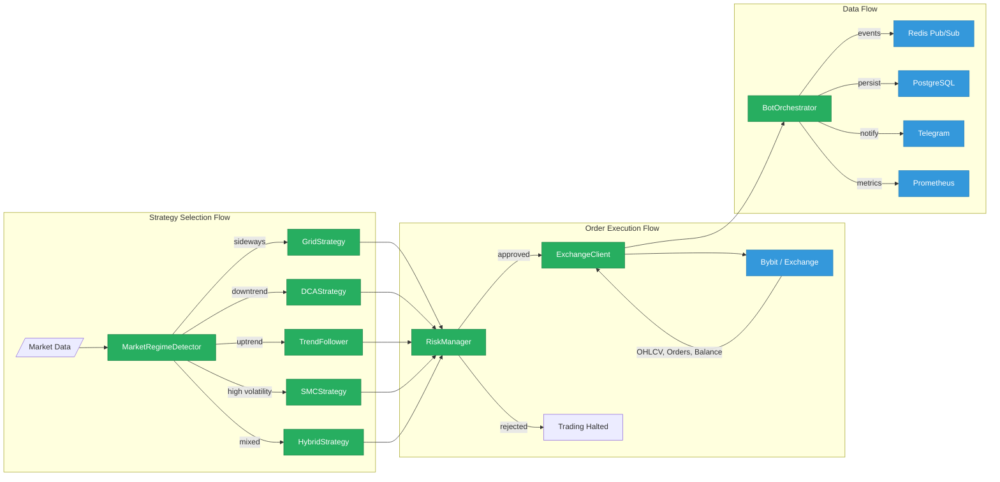

# TRADERAGENT v2.0 — Architecture & Implementation Status

**Updated:** 2026-02-16 | **Tests:** 347/347 (100%) | **Release:** v2.0.0

> Legend: `[DONE]` — implemented & tested | `[PARTIAL]` — needs verification | `[TODO]` — not started

---

## System Architecture Diagram

```mermaid
graph TB
    subgraph UI["<b>USER INTERFACE LAYER</b>"]
        direction LR
        TG["🟢 Telegram Bot<br/><i>bot/telegram/bot.py</i><br/>847 lines<br/><b>[DONE]</b>"]
        WEBUI["🔴 Web UI Dashboard<br/><i>React + FastAPI</i><br/><b>[TODO — v2.0 Roadmap]</b>"]
    end

    subgraph ORCH["<b>ORCHESTRATION LAYER</b> — Phase 1 🟢"]
        direction LR
        BO["🟢 BotOrchestrator<br/><i>orchestrator/bot_orchestrator.py</i><br/>1191 lines<br/><b>[DONE]</b>"]
        SS["🟢 StrategySelector<br/><i>orchestrator/strategy_selector.py</i><br/>475 lines<br/><b>[DONE]</b>"]
        MR["🟢 MarketRegime<br/><i>orchestrator/market_regime.py</i><br/><b>[DONE]</b>"]
        SR["🟢 StrategyRegistry<br/><i>orchestrator/strategy_registry.py</i><br/><b>[DONE]</b>"]
        EV["🟢 Events<br/><i>orchestrator/events.py</i><br/><b>[DONE]</b>"]
        HM["🟢 HealthMonitor<br/><i>orchestrator/health_monitor.py</i><br/><b>[DONE]</b>"]
    end

    subgraph STRAT["<b>STRATEGIES LAYER</b> — Phases 1-4 🟢"]
        direction TB

        subgraph GRID["Phase 2: Grid Trading 🟢"]
            direction LR
            GC["🟢 GridCalculator<br/>577 lines"]
            GOM["🟢 GridOrderManager<br/>557 lines"]
            GRM["🟢 GridRiskManager<br/>520 lines"]
            GA["🟢 GridAdapter"]
        end

        subgraph DCA["Phase 3: DCA Engine 🟢"]
            direction LR
            DSG["🟢 DCASignalGenerator<br/>638 lines"]
            DPM["🟢 DCAPositionManager<br/>678 lines"]
            DRM["🟢 DCARiskManager<br/>610 lines"]
            DE["🟢 DCAEngine<br/>440 lines"]
            DTS["🟢 DCATrailingStop"]
            DA["🟢 DCAAdapter"]
        end

        subgraph HYBRID["Phase 4: Hybrid 🟢"]
            direction LR
            HS["🟢 HybridStrategy<br/>456 lines"]
            MRD["🟢 MarketRegimeDetector<br/>650 lines"]
        end

        subgraph SMC["SMC Strategy 🟢"]
            direction LR
            SMS["🟢 SMCStrategy<br/>323 lines"]
            CZ["🟢 ConfluenceZones<br/>604 lines"]
            ES["🟢 EntrySignals<br/>676 lines"]
            MS["🟢 MarketStructure<br/>436 lines"]
            SPM["🟢 PositionManager<br/>557 lines"]
            SA["🟢 SMCAdapter"]
        end

        subgraph TF["Trend Follower 🟢"]
            direction LR
            TFS["🟢 TFStrategy<br/>468 lines"]
            MA["🟢 MarketAnalyzer<br/>316 lines"]
            EL["🟢 EntryLogic<br/>447 lines"]
            TPM["🟢 PositionManager<br/>436 lines"]
            TRM["🟢 RiskManager<br/>409 lines"]
            TFA["🟢 TFAdapter"]
        end

        BS["🟢 BaseStrategy<br/><i>strategies/base.py</i><br/>329 lines"]
    end

    subgraph CORE["<b>CORE LAYER</b>"]
        direction LR
        GE["🟢 GridEngine<br/><i>core/grid_engine.py</i><br/><b>[DONE]</b>"]
        DCE["🟢 DCAEngine<br/><i>core/dca_engine.py</i><br/><b>[DONE]</b>"]
        RM["🟢 RiskManager<br/><i>core/risk_manager.py</i><br/><b>[DONE]</b>"]
    end

    subgraph INFRA["<b>INFRASTRUCTURE LAYER</b> — Phase 5"]
        direction LR

        subgraph EXCHANGE["Exchange API 🟢"]
            EC["🟢 ExchangeClient<br/><i>api/exchange_client.py</i><br/>671 lines — CCXT"]
            BD["🟢 BybitDirectClient<br/><i>api/bybit_direct_client.py</i>"]
        end

        subgraph DB["Database 🟢"]
            DBM["🟢 DatabaseManager<br/><i>database/manager.py</i><br/>401 lines"]
            MOD["🟢 Models<br/><i>database/models.py</i>"]
            MIG["🟢 Migrations<br/><i>database/migrations.py</i>"]
            BKP["🟢 Backup<br/><i>database/backup.py</i>"]
        end

        subgraph MON["Monitoring 🟡"]
            ME["🟡 MetricsExporter<br/><i>monitoring/metrics_exporter.py</i><br/>252 lines"]
            MC["🟡 MetricsCollector<br/><i>monitoring/metrics_collector.py</i>"]
            AH["🟡 AlertHandler<br/><i>monitoring/alert_handler.py</i><br/>174 lines"]
        end

        subgraph CFG["Config 🟢"]
            CM["🟢 ConfigManager<br/><i>config/manager.py</i>"]
            CS["🟢 ConfigSchemas<br/><i>config/schemas.py</i>"]
            CV["🟢 ConfigValidator<br/><i>utils/config_validator.py</i>"]
        end

        subgraph UTIL["Utils 🟢"]
            LOG["🟢 Logger<br/><i>utils/logger.py</i>"]
            CAP["🟢 CapitalManager<br/><i>utils/capital_manager.py</i>"]
            SEC["🟢 SecurityAudit<br/><i>utils/security_audit.py</i>"]
        end
    end

    subgraph TEST["<b>TESTING LAYER</b> — Phases 6-7 🟢"]
        direction LR

        subgraph UNIT["Unit Tests: 137/137 🟢"]
            UT1["RiskManager 33"]
            UT2["BotOrchestrator 21"]
            UT3["DCAEngine 24"]
            UT4["GridEngine 16"]
            UT5["Config 27"]
            UT6["Events+DB+Logger 16"]
        end

        subgraph INTEG["Integration: 76/76 🟢"]
            IT1["TrendFollower Integ 37"]
            IT2["TrendFollower E2E 22"]
            IT3["Orchestration 10"]
            IT4["Module Integration 7"]
        end

        subgraph BACKT["Backtesting: 134/134 🟢"]
            BT1["Advanced Analytics 44"]
            BT2["Multi-TF 36"]
            BT3["Reports 33"]
            BT4["Multi-Strategy 31"]
            BT5["Core Backtesting 15"]
        end
    end

    subgraph DEVOPS["<b>DEVOPS LAYER</b> — Phase 5"]
        direction LR
        DOC["🟡 Dockerfile<br/><b>[PARTIAL]</b>"]
        DC["🟡 docker-compose.yml<br/><b>[PARTIAL]</b>"]
        DCM["🟡 docker-compose.monitoring.yml<br/><b>[PARTIAL]</b>"]
        PROM["🟡 Prometheus<br/><i>monitoring/prometheus/</i>"]
        GRAF["🟡 Grafana<br/><i>monitoring/grafana/</i><br/>dashboard: traderagent.json"]
        ALRT["🟡 AlertManager<br/><i>monitoring/alertmanager/</i>"]
    end

    subgraph EXT["<b>EXTERNAL SERVICES</b>"]
        direction LR
        BYBIT["🔵 Bybit Exchange"]
        CCXT["🔵 CCXT (150+ exchanges)"]
        PG["🔵 PostgreSQL"]
        REDIS["🔵 Redis Pub/Sub"]
        TGAPI["🔵 Telegram API"]
    end

    subgraph TODO["<b>NOT IMPLEMENTED</b> ❌"]
        direction TB
        T73["🔴 Phase 7.3: Testnet Deployment<br/><i>2-week live testing on Bybit</i>"]
        T74["🔴 Phase 7.4: Load/Stress Testing"]
        T8["🔴 Phase 8: Production Launch<br/><i>Security audit, gradual capital deployment</i>"]
        R2WEB["🔴 ROADMAP v2.0: Web UI Dashboard<br/><i>React + FastAPI + WebSocket</i>"]
        R2MA["🔴 ROADMAP v2.0: Multi-Account"]
        R2REP["🔴 ROADMAP v2.0: Enhanced Reporting<br/><i>PDF, email, tax</i>"]
    end

    %% Connections
    UI --> ORCH
    TG --> TGAPI
    BO --> SS
    BO --> SR
    BO --> EV
    BO --> HM
    SS --> MR
    ORCH --> STRAT
    BS --> GRID
    BS --> DCA
    BS --> HYBRID
    BS --> SMC
    BS --> TF
    STRAT --> CORE
    CORE --> INFRA
    EC --> CCXT
    EC --> BYBIT
    BD --> BYBIT
    DBM --> PG
    EV --> REDIS
    MON --> PROM
    DEVOPS --> INFRA
    TEST --> STRAT
    TEST --> CORE

    %% Styling
    classDef done fill:#27ae60,stroke:#1e8449,color:white
    classDef partial fill:#f39c12,stroke:#d68910,color:white
    classDef todo fill:#e74c3c,stroke:#c0392b,color:white
    classDef ext fill:#3498db,stroke:#2980b9,color:white

    class TG,BO,SS,MR,SR,EV,HM done
    class GC,GOM,GRM,GA done
    class DSG,DPM,DRM,DE,DTS,DA done
    class HS,MRD done
    class SMS,CZ,ES,MS,SPM,SA done
    class TFS,MA,EL,TPM,TRM,TFA done
    class BS,GE,DCE,RM done
    class EC,BD,DBM,MOD,MIG,BKP done
    class CM,CS,CV,LOG,CAP,SEC done
    class UT1,UT2,UT3,UT4,UT5,UT6 done
    class IT1,IT2,IT3,IT4 done
    class BT1,BT2,BT3,BT4,BT5 done
    class ME,MC,AH,DOC,DC,DCM,PROM,GRAF,ALRT partial
    class WEBUI,T73,T74,T8,R2WEB,R2MA,R2REP todo
    class BYBIT,CCXT,PG,REDIS,TGAPI ext
```



---

## Implementation Status by Phase

```
Phase 1: Architecture Foundation      ██████████████████████████████ 100%  🟢
Phase 2: Grid Trading Engine          ██████████████████████████████ 100%  🟢
Phase 3: DCA Engine                   ██████████████████████████████ 100%  🟢
Phase 4: Hybrid Strategy              ██████████████████████████████ 100%  🟢
Phase 5: Infrastructure & DevOps      ████████████████████████░░░░░░  80%  🟡
Phase 6: Advanced Backtesting         ██████████████████████████████ 100%  🟢
Phase 7: Testing & Validation         █████████████████████░░░░░░░░░  70%  🟡
Phase 8: Production Launch            ░░░░░░░░░░░░░░░░░░░░░░░░░░░░░░   0%  🔴
```

## File Statistics

| Layer | Files | Total Lines | Status |
|-------|-------|-------------|--------|
| Orchestrator | 6 | ~3,500 | 🟢 DONE |
| Strategies (Grid) | 4 | ~1,750 | 🟢 DONE |
| Strategies (DCA) | 7 | ~3,200 | 🟢 DONE |
| Strategies (Hybrid) | 3 | ~1,200 | 🟢 DONE |
| Strategies (SMC) | 6 | ~2,650 | 🟢 DONE |
| Strategies (TF) | 7 | ~2,500 | 🟢 DONE |
| Core (engines) | 3 | ~1,500 | 🟢 DONE |
| API (exchange) | 3 | ~1,200 | 🟢 DONE |
| Database | 5 | ~1,500 | 🟢 DONE |
| Config | 3 | ~1,000 | 🟢 DONE |
| Telegram | 1 | 847 | 🟢 DONE |
| Monitoring | 3 | ~600 | 🟡 PARTIAL |
| Utils | 4 | ~800 | 🟢 DONE |
| **Tests** | **21** | **~8,000** | **🟢 347/347** |
| DevOps (Docker/Monitoring configs) | 7 | ~500 | 🟡 PARTIAL |

**Total: ~85 Python files, ~30,000+ lines of code**

## Component Dependency Map



## Remaining Work (Priority Order)

### HIGH — Complete v2.0 Plan
```
┌─────────────────────────────────────────────────────────────┐
│  1. Phase 5 — Verify DevOps stack                    🟡    │
│     ├── Test Docker build & compose up                     │
│     ├── Verify Prometheus scraping bot metrics              │
│     ├── Verify Grafana dashboard loads                     │
│     └── Test AlertManager notifications                    │
│                                                             │
│  2. Phase 7.3 — Testnet Deployment                   🔴    │
│     ├── Deploy to Bybit testnet                            │
│     ├── Run all strategies in parallel (2 weeks)           │
│     ├── Monitor stability and performance                  │
│     └── Collect production-like metrics                    │
│                                                             │
│  3. Phase 7.4 — Load & Stress Testing                🔴    │
│     ├── High order volume simulation                       │
│     ├── Database under load                                │
│     ├── API rate limit handling                            │
│     └── Memory leak detection                              │
│                                                             │
│  4. Phase 8 — Production Launch                      🔴    │
│     ├── Security audit                                     │
│     ├── Gradual capital deployment (5% → 25% → 100%)       │
│     └── Documentation finalization                         │
└─────────────────────────────────────────────────────────────┘
```

### MEDIUM — ROADMAP v2.0 New Features
```
┌─────────────────────────────────────────────────────────────┐
│  5. Web UI Dashboard (Q2 2026)                       🔴    │
│     ├── FastAPI REST backend                               │
│     ├── React + TypeScript frontend                        │
│     ├── Real-time WebSocket updates                        │
│     └── Bot management, analytics, config editor           │
│                                                             │
│  6. Multi-Account Support                            🔴    │
│  7. Enhanced Reporting (PDF, email, tax)             🔴    │
│  8. Historical Data Integration                      🔴    │
│     └── 450 CSVs (5.4 GB) → backtesting framework         │
└─────────────────────────────────────────────────────────────┘
```
