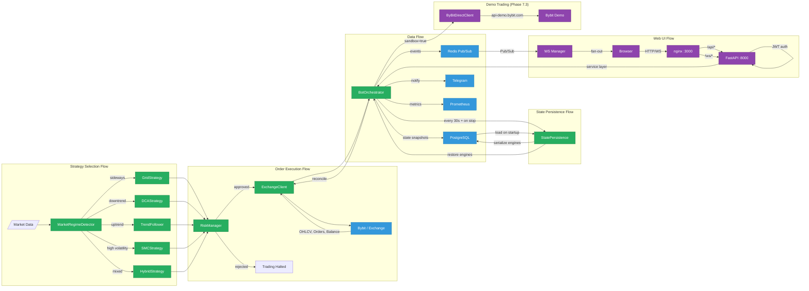

# TRADERAGENT v2.0 — Architecture & Implementation Status

**Updated:** 2026-02-23 | **Tests:** 1,531 passed (100%) | **Release:** v2.0.0 | **Demo Trading:** LIVE on Bybit | **Web UI:** COMPLETE | **State Persistence:** COMPLETE | **Audit Bugs:** FIXED (12/12 + 3 SMC + 1 status normalization)

> Legend: `[DONE]` — implemented & tested | `[TODO]` — not started

---

## System Architecture Diagram

```mermaid
graph TB
    subgraph UI["<b>USER INTERFACE LAYER</b>"]
        direction LR
        TG["Telegram Bot<br/><i>bot/telegram/bot.py</i><br/>860 lines<br/><b>[DONE]</b>"]
        WEBUI["Web UI Dashboard<br/><i>React + FastAPI + WebSocket</i><br/>42 API routes, 7 pages<br/><b>[DONE]</b>"]
    end

    subgraph ORCH["<b>ORCHESTRATION LAYER</b> — Phase 1"]
        direction LR
        BO["BotOrchestrator<br/><i>orchestrator/bot_orchestrator.py</i><br/>1,377 lines<br/><b>[DONE]</b>"]
        SS["StrategySelector<br/><i>orchestrator/strategy_selector.py</i><br/>475 lines<br/><b>[DONE]</b>"]
        MR["MarketRegime<br/><i>orchestrator/market_regime.py</i><br/><b>[DONE]</b>"]
        SR["StrategyRegistry<br/><i>orchestrator/strategy_registry.py</i><br/><b>[DONE]</b>"]
        EV["Events<br/><i>orchestrator/events.py</i><br/><b>[DONE]</b>"]
        HM["HealthMonitor<br/><i>orchestrator/health_monitor.py</i><br/><b>[DONE]</b>"]
        SP["StatePersistence<br/><i>orchestrator/state_persistence.py</i><br/>356 lines<br/><b>[DONE]</b>"]
    end

    subgraph STRAT["<b>STRATEGIES LAYER</b> — Phases 1-4"]
        direction TB

        subgraph GRID["Phase 2: Grid Trading"]
            direction LR
            GC["GridCalculator<br/>577 lines"]
            GOM["GridOrderManager<br/>557 lines"]
            GRM["GridRiskManager<br/>520 lines"]
            GA["GridAdapter"]
        end

        subgraph DCA["Phase 3: DCA Engine"]
            direction LR
            DSG["DCASignalGenerator<br/>638 lines"]
            DPM["DCAPositionManager<br/>678 lines"]
            DRM["DCARiskManager<br/>610 lines"]
            DE["DCAEngine<br/>440 lines"]
            DTS["DCATrailingStop"]
            DA["DCAAdapter"]
        end

        subgraph HYBRID["Phase 4: Hybrid"]
            direction LR
            HS["HybridStrategy<br/>456 lines"]
            MRD["MarketRegimeDetector<br/>650 lines"]
        end

        subgraph SMC["SMC Strategy"]
            direction LR
            SMS["SMCStrategy<br/>323 lines"]
            CZ["ConfluenceZones<br/>604 lines"]
            ES["EntrySignals<br/>676 lines"]
            MS["MarketStructure<br/>436 lines"]
            SPM["PositionManager<br/>557 lines"]
            SA["SMCAdapter"]
        end

        subgraph TF["Trend Follower"]
            direction LR
            TFS["TFStrategy<br/>468 lines"]
            MA["MarketAnalyzer<br/>316 lines"]
            EL["EntryLogic<br/>447 lines"]
            TPM["PositionManager<br/>436 lines"]
            TRM["RiskManager<br/>409 lines"]
            TFA["TFAdapter"]
        end

        BS["BaseStrategy<br/><i>strategies/base.py</i><br/>329 lines"]
    end

    subgraph GRIDBT["<b>GRID BACKTESTING</b> — COMPLETE"]
        direction LR
        GBS["GridBacktestSimulator<br/><i>backtesting/grid/simulator.py</i><br/>415 lines"]
        GBC["CoinClusterizer<br/><i>backtesting/grid/clusterizer.py</i><br/>157 lines"]
        GBO["GridOptimizer<br/><i>backtesting/grid/optimizer.py</i><br/>393 lines"]
        GBR["GridBacktestReporter<br/><i>backtesting/grid/reporter.py</i><br/>164 lines"]
        GBSYS["GridBacktestSystem<br/><i>backtesting/grid/system.py</i><br/>250 lines"]
    end

    subgraph CORE["<b>CORE LAYER</b>"]
        direction LR
        GE["GridEngine<br/><i>core/grid_engine.py</i><br/><b>[DONE]</b>"]
        DCE["DCAEngine<br/><i>core/dca_engine.py</i><br/><b>[DONE]</b>"]
        RM["RiskManager<br/><i>core/risk_manager.py</i><br/><b>[DONE]</b>"]
    end

    subgraph INFRA["<b>INFRASTRUCTURE LAYER</b> — Phase 5"]
        direction LR

        subgraph EXCHANGE["Exchange API"]
            EC["ExchangeClient<br/><i>api/exchange_client.py</i><br/>671 lines — CCXT"]
            BD["BybitDirectClient<br/><i>api/bybit_direct_client.py</i><br/>~900 lines — Demo Trading"]
        end

        subgraph DB["Database"]
            DBM["DatabaseManager<br/><i>database/manager.py</i><br/>450 lines"]
            MOD["Models<br/><i>database/models.py</i>"]
            MST["BotStateSnapshot<br/><i>database/models_state.py</i>"]
            MIG["Migrations<br/><i>database/migrations.py</i>"]
            BKP["Backup<br/><i>database/backup.py</i>"]
        end

        subgraph MON["Monitoring"]
            ME["MetricsExporter<br/><i>monitoring/metrics_exporter.py</i><br/>252 lines"]
            MC["MetricsCollector<br/><i>monitoring/metrics_collector.py</i>"]
            AH["AlertHandler<br/><i>monitoring/alert_handler.py</i><br/>174 lines"]
        end

        subgraph CFG["Config"]
            CM["ConfigManager<br/><i>config/manager.py</i>"]
            CS["ConfigSchemas<br/><i>config/schemas.py</i>"]
            CV["ConfigValidator<br/><i>utils/config_validator.py</i>"]
        end

        subgraph UTIL["Utils"]
            LOG["Logger<br/><i>utils/logger.py</i>"]
            CAP["CapitalManager<br/><i>utils/capital_manager.py</i>"]
            SEC["SecurityAudit<br/><i>utils/security_audit.py</i>"]
        end
    end

    subgraph WEBSTACK["<b>WEB UI LAYER</b> — COMPLETE"]
        direction LR

        subgraph WEBBACK["Backend (FastAPI)"]
            WBA["Auth (JWT+bcrypt)<br/><i>web/backend/auth/</i>"]
            WBR["REST API (42 routes)<br/><i>web/backend/api/v1/</i>"]
            WBS["Services Layer<br/><i>web/backend/services/</i>"]
            WBW["WebSocket<br/><i>web/backend/ws/</i>"]
        end

        subgraph WEBFRONT["Frontend (React)"]
            WFP["7 Pages<br/><i>Dashboard, Bots, Strategies,<br/>Portfolio, Backtesting, Settings, Login</i>"]
            WFC["11 Components<br/><i>Card, Button, Badge, Modal,<br/>Toast, Toggle, Skeleton, Spinner,<br/>ErrorBoundary, PageTransition</i>"]
            WFS["Zustand Stores<br/><i>auth, bots, UI</i>"]
        end

        subgraph WEBDOCK["Docker"]
            WDB["Backend Dockerfile<br/><i>FastAPI + uvicorn</i>"]
            WDF["Frontend Dockerfile<br/><i>Node build → nginx</i>"]
            WDN["nginx.conf<br/><i>SPA + API/WS proxy</i>"]
        end
    end

    subgraph TEST["<b>TESTING LAYER</b> — 1,441/1,441"]
        direction LR

        subgraph BTEST["Bot Tests: 385"]
            UT1["Unit 175"]
            UT2["Integration 76"]
            UT3["Backtesting 134"]
        end

        subgraph STEST["Strategy Tests: 743"]
            ST1["SMC 575"]
            ST2["Hybrid 168"]
        end

        subgraph PTEST["Persistence Tests: 227"]
            PT1["Orchestrator State 29"]
            PT2["DB State Model 6"]
            PT3["Other Orchestrator 192"]
        end

        subgraph WEBT["Web API: 46"]
            WT1["Bots API 15"]
            WT2["Auth 12"]
            WT3["Strategies 8"]
            WT4["Portfolio 6"]
            WT5["Settings 5"]
        end

        subgraph LOADT["Load/Stress: 40"]
            LT1["API Load 9"]
            LT2["WebSocket 5"]
            LT3["DB Pool 5"]
            LT4["Event 4"]
            LT5["Multi-bot 5"]
            LT6["Rate Limit 4"]
            LT7["Backtesting 4"]
            LT8["Memory 5"]
        end
    end

    subgraph DEVOPS["<b>DEVOPS LAYER</b> — Phase 5"]
        direction LR
        DOC["Dockerfile<br/><b>[DONE]</b>"]
        DC["docker-compose.yml<br/><i>bot + webui-backend + webui-frontend</i><br/><b>[DONE]</b>"]
        DCM["docker-compose.monitoring.yml"]
        PROM["Prometheus<br/><i>monitoring/prometheus/</i>"]
        GRAF["Grafana<br/><i>monitoring/grafana/</i><br/>dashboard: traderagent.json"]
        ALRT["AlertManager<br/><i>monitoring/alertmanager/</i>"]
        VALD["validate_demo.py<br/><i>scripts/</i>"]
        STRT["start_demo.sh<br/><i>scripts/</i>"]
    end

    subgraph EXT["<b>EXTERNAL SERVICES</b>"]
        direction LR
        BYBIT["Bybit Exchange<br/><i>api-demo.bybit.com</i>"]
        CCXTEX["CCXT (150+ exchanges)"]
        PG["PostgreSQL"]
        REDIS["Redis Pub/Sub"]
        TGAPI["Telegram API"]
    end

    %% Connections
    UI --> ORCH
    TG --> TGAPI
    WEBUI --> WEBSTACK
    BO --> SS
    BO --> SR
    BO --> EV
    BO --> HM
    BO --> SP
    SP --> DBM
    SS --> MR
    ORCH --> STRAT
    BS --> GRID
    BS --> DCA
    BS --> HYBRID
    BS --> SMC
    BS --> TF
    STRAT --> CORE
    GRIDBT --> GRID
    GBSYS --> GBS
    GBSYS --> GBC
    GBSYS --> GBO
    GBSYS --> GBR
    CORE --> INFRA
    EC --> CCXTEX
    EC --> BYBIT
    BD --> BYBIT
    DBM --> PG
    EV --> REDIS
    WBW --> REDIS
    WBS --> BO
    MON --> PROM
    DEVOPS --> INFRA
    TEST --> STRAT
    TEST --> CORE

    %% Styling
    classDef done fill:#27ae60,stroke:#1e8449,color:white
    classDef todo fill:#e74c3c,stroke:#c0392b,color:white
    classDef ext fill:#3498db,stroke:#2980b9,color:white
    classDef webui fill:#8e44ad,stroke:#6c3483,color:white

    class TG,BO,SS,MR,SR,EV,HM,SP done
    class GC,GOM,GRM,GA done
    class DSG,DPM,DRM,DE,DTS,DA done
    class HS,MRD done
    class SMS,CZ,ES,MS,SPM,SA done
    class TFS,MA,EL,TPM,TRM,TFA done
    class BS,GE,DCE,RM done
    class EC,BD,DBM,MOD,MST,MIG,BKP done
    class CM,CS,CV,LOG,CAP,SEC done
    class ME,MC,AH done
    class DOC,DC,DCM,PROM,GRAF,ALRT,VALD,STRT done
    class UT1,UT2,UT3 done
    class ST1,ST2 done
    class PT1,PT2,PT3 done
    class WT1,WT2,WT3,WT4,WT5 done
    class LT1,LT2,LT3,LT4,LT5,LT6,LT7,LT8 done
    class GBS,GBC,GBO,GBR,GBSYS done
    class WEBUI,WBA,WBR,WBS,WBW,WFP,WFC,WFS,WDB,WDF,WDN webui
    class BYBIT,CCXTEX,PG,REDIS,TGAPI ext
```



---

## Implementation Status by Phase

```
Phase 1: Architecture Foundation      ██████████████████████████████ 100%
Phase 2: Grid Trading Engine          ██████████████████████████████ 100%
Phase 3: DCA Engine                   ██████████████████████████████ 100%
Phase 4: Hybrid Strategy              ██████████████████████████████ 100%  (regime→trading: TODO v2.1)
Phase 5: Infrastructure & DevOps      ██████████████████████████████ 100%
Phase 6: Advanced Backtesting         ██████████████████████████████ 100%
Phase 7.1-7.2: Unit & Integration     ██████████████████████████████ 100%  1,531 tests
Phase 7.3: Demo Trading (Bybit)       ██████████████████████████████ 100%  DEPLOYED, 5 bots
Phase 7.4: Load/Stress Testing        ██████████████████████████████ 100%  COMPLETE
Phase 8: Production Readiness         ██████████████████████████████ 100%  12/12 + 4 new bugs FIXED
Web UI Dashboard                      ██████████████████████████████ 100%  COMPLETE
Grid Backtesting System               ██████████████████████████████ 100%  COMPLETE
State Persistence                     ██████████████████████████████ 100%  COMPLETE
Multi-Symbol Pipeline (DCA+TF+SMC)    ████████████░░░░░░░░░░░░░░░░░░  40%  Phase 1 DONE, Phase 2 IN PROGRESS
```

---

## State Persistence Architecture

### Overview

Trading state (positions, orders, grid levels, DCA steps, risk counters) is persisted to PostgreSQL every 30 seconds and on shutdown. On restart, the bot loads its last state and reconciles with the exchange.

### Components

```
bot/orchestrator/state_persistence.py  — Serialize/deserialize all engines (356 lines)
bot/database/models_state.py           — BotStateSnapshot SQLAlchemy model
bot/database/manager.py                — save/load/delete_state_snapshot methods
```

### Lifecycle

```
initialize() ──→ load_state() ──→ DB: SELECT bot_state_snapshots WHERE bot_name=?
                                     │
start() ──→ if state loaded ──→ reconcile_with_exchange()
             else ──→ fresh grid init                │
                                                     ├── Grid: fetch_open_orders(), check filled vs orphaned
                                                     └── Risk: fetch_balance(), update_balance()
                                                         │
_main_loop() ──→ every 30s ──→ save_state() ──→ DB: UPSERT bot_state_snapshots
                                                         │
stop() / emergency_stop() ──→ save_state() ──→ DB: UPSERT (final state)
                                                         │
reset_state() ──→ DB: DELETE bot_state_snapshots WHERE bot_name=?
```

### Serialized State per Engine

| Engine | Fields Persisted |
|--------|-----------------|
| Grid | active_orders (level, price, amount, side, filled), total_profit, buy_count, sell_count |
| DCA | position (symbol, entry, amount, step, cost, avg_price), last_buy_price, highest_price, total_steps, invested, realized_profit |
| Risk | initial/current/peak balance, daily_loss, is_halted, halt_reason, trade counters |
| Trend | current_capital, consecutive_losses, daily_pnl, daily_trades |
| Hybrid | mode, mode_since, last_transition, transition counters, regime detector state |

---

## Web UI Dashboard Architecture

### Backend (FastAPI) — 42 REST API Routes + WebSocket

```
web/backend/
├── app.py              # Factory + lifespan (shared process with BotApplication)
├── main.py             # uvicorn web.backend.main:app
├── config.py           # pydantic-settings (JWT_SECRET, CORS, ports)
├── dependencies.py     # get_db, get_current_user, get_orchestrators
├── auth/
│   ├── models.py       # User, UserSession (SQLAlchemy, extends Base)
│   ├── schemas.py      # LoginRequest, TokenResponse, UserResponse
│   ├── service.py      # JWT (python-jose), bcrypt, refresh tokens
│   └── router.py       # /api/v1/auth/* (register, login, refresh, logout, me)
├── api/v1/
│   ├── router.py       # Aggregate v1 router
│   ├── bots.py         # CRUD + start/stop/pause/resume/emergency-stop
│   ├── strategies.py   # Templates marketplace + copy-trading (DB-persisted)
│   ├── portfolio.py    # Summary, allocation, drawdown, trades
│   ├── backtesting.py  # Real GridBacktestSimulator (online OHLCV + offline fallback)
│   ├── market.py       # Ticker, OHLCV (wraps ExchangeAPIClient)
│   ├── dashboard.py    # Aggregated overview
│   └── settings.py     # Reads from config_manager with fallback
├── ws/
│   ├── manager.py      # ConnectionManager (per-channel fan-out, heartbeat)
│   ├── events.py       # RedisBridge (Pub/Sub → WebSocket)
│   └── router.py       # /ws/events, /ws/bots/{name}
├── schemas/            # Pydantic request/response models
└── services/
    └── bot_service.py  # BotOrchestrator bridge layer (async)
```

### Frontend (React 19 + TypeScript + Tailwind CSS v4)

```
web/frontend/src/
├── api/                # Axios client (JWT interceptor + auto-refresh), auth, bots, websocket
├── stores/             # Zustand: authStore, botStore, uiStore
├── components/
│   ├── layout/         # AppLayout, Sidebar (responsive), Header (hamburger)
│   ├── common/         # Card, Button, Badge, Modal, Toast, Toggle, Skeleton,
│   │                   # Spinner, ErrorBoundary, PageTransition
│   └── bots/           # BotCard (Framer Motion animated)
├── pages/              # Dashboard, Bots, Strategies, Portfolio, Backtesting, Settings, Login
├── router/             # ProtectedRoute, createBrowserRouter
└── styles/             # globals.css (Tailwind + Veles theme tokens), theme.ts
```

**Design tokens (Veles-inspired):** `#0d1117` bg, `#161b22` surface, `#640075` primary, `#3fb950` profit, `#f85149` loss, `#007aff` blue, `#ed800d` orange

**Docker:** `webui-backend` (:8000, FastAPI/uvicorn) + `webui-frontend` (:3000, nginx serving React build with API/WS proxy)

**PR:** https://github.com/alekseymavai/TRADERAGENT/pull/221 (merged)

---

## Phase 7.3 — Demo Trading Details

**Deployed:** 2026-02-16 on `185.233.200.13` (Docker)
**Exchange:** `api-demo.bybit.com` (Bybit Demo Trading, production API keys)
**Balance:** 100,000 USDT (virtual)

| Bot | Symbol | Strategy | Amount/Order | Status |
|-----|--------|----------|-------------|--------|
| demo_btc_hybrid | BTC/USDT | Hybrid (Grid+DCA) | $150 (~0.002 BTC) | auto_start, dry_run:false |
| demo_eth_grid | ETH/USDT | Grid | $30/grid | manual start |
| demo_sol_dca | SOL/USDT | DCA | $20/step | manual start |
| demo_btc_trend | BTC/USDT | Trend Follower | ATR-based | manual start |
| demo_btc_smc | BTC/USDT | SMC | 2% risk/trade | auto_start, dry_run:true |

**Key architectural decision:** CCXT `set_sandbox_mode(True)` routes to `testnet.bybit.com` (wrong endpoint, separate keys). `ByBitDirectClient` connects directly to `api-demo.bybit.com` using production API keys.

**Bybit status normalization:** `ByBitDirectClient` normalizes native Bybit `orderStatus` to CCXT-compatible values via `_normalize_order_status()`:
- `"Filled"` → `"closed"` | `"New"` / `"PartiallyFilled"` → `"open"`
Applied in `fetch_open_orders()`, `fetch_order()`, `fetch_closed_orders()`.

**Architectural gap — Hybrid strategy:** `MarketRegimeDetector` runs in `_regime_monitor_loop()` every 60s and publishes regime to Redis, but `_main_loop()` does NOT read regime recommendations. `HybridStrategy.evaluate()` is never called. Grid and DCA engines always run simultaneously. Planned fix: connect regime output to main loop in v2.1.

**Bugs fixed during Session 27-28:**
- `KeyError: 'take_profit_hit'` → `tp_triggered` (DCA engine key mismatch)
- Grid qty=0 (USD→BTC conversion rounding to 0.000 with `Decimal("0.001")`)
- Bybit "Qty invalid" (qty precision must match instrument's `basePrecision`)
- Telegram Markdown parse errors (added plain-text fallback)
- `grid_order_not_filled` warning loop (Bybit `"filled"` vs CCXT `"closed"`) — `a7f4e66`
- SMC wrong trend key (`"trend"` → `"current_trend"`) — `f06dc8c`
- SMC stale signal filter (>2% from current price) — `f06dc8c`
- Bybit status normalization at source — `b477fbf`

---

## Phase 7.4 — Load/Stress Testing Details

**Completed:** 2026-02-16 | **Tests:** 40/40 passed | **Commit:** `ef251fb`

All tests run WITHOUT external services (in-memory SQLite, mock WebSocket, mock exchange).

```
tests/loadtest/
├── conftest.py                  # Shared fixtures (SQLite, mock orchestrators, FastAPI app, auth)
├── test_api_load.py             # 9 tests — REST API under concurrent load (50-500 requests)
├── test_websocket_stress.py     # 5 tests — ConnectionManager fan-out (100-500 connections)
├── test_database_pool.py        # 5 tests — Concurrent DB reads/writes (50-500 operations)
├── test_event_throughput.py     # 4 tests — Event create/serialize/broadcast (10K-100K)
├── test_orchestrator_multi.py   # 5 tests — Multi-bot StrategyRegistry lifecycle (100 strategies)
├── test_exchange_ratelimit.py   # 4 tests — Adaptive rate limiter (backoff/recovery)
├── test_backtest_load.py        # 4 tests — Async job submissions + semaphore(2) verification
└── test_memory_profiling.py     # 5 tests — tracemalloc leak detection (50K events, 5K OHLCV)
```

### Performance Benchmarks

| Component | Metric | Result |
|-----------|--------|--------|
| REST API (/health) | 500 concurrent requests | 1,599 req/s |
| REST API (mixed endpoints) | 100 concurrent requests | 236 req/s |
| REST API (sequential) | 200 requests throughput | 111 req/s |
| WebSocket broadcast | 100 subscribers x 1000 messages | 15,826 sends/s |
| WebSocket channel fanout | 50 channels x 10 subscribers x 100 messages | 50,000 sends |
| Database writes (sequential) | 500 orders in single session | 921 writes/s |
| Database writes (concurrent) | 50 concurrent order inserts | 714 writes/s |
| Database queries | 50 concurrent bot lookups | 828 queries/s |
| Event creation + serialization | 10,000 TradingEvent objects | 39,842/s |
| Event deserialization | 10,000 JSON strings | 114,226/s |
| Strategy lifecycle | 100 strategies register+start+stop | < 2s |
| Memory (50K events) | Peak memory for 50,000 events | < 100 MB |
| Memory (position lifecycle) | 500 open+close cycles | No leaks |

**Bugfix discovered during testing:** FastAPI route ordering — `GET /api/v1/backtesting/history` returned 404 because `/{job_id}` parameter route shadowed `/history`. Fixed by reordering routes.

---

## Grid Backtesting System Details

**Completed:** 2026-02-16 | **Tests:** 39/39 passed | **Commit:** `bb31467`

Grid-specific backtesting system with coin clustering, two-phase parameter optimization, stress testing, and preset export.

```
bot/backtesting/grid/
├── __init__.py          # Re-exports all public classes
├── models.py            # GridBacktestConfig, GridBacktestResult, enums (268 lines)
├── simulator.py         # GridBacktestSimulator — core simulation loop (415 lines)
├── clusterizer.py       # CoinClusterizer — ATR%/volume classification (157 lines)
├── optimizer.py         # GridOptimizer — coarse→fine search (393 lines)
├── reporter.py          # Reports + JSON/YAML preset export (164 lines)
└── system.py            # End-to-end pipeline orchestrator (250 lines)

tests/backtesting/grid/
├── test_simulator.py    # 14 tests — simulation, directions, risk, fees
├── test_clusterizer.py  # 12 tests — coin classification per cluster
├── test_optimizer.py    #  6 tests — optimization, objectives, param impact
└── test_system.py       #  7 tests — e2e pipeline, stress testing, export
```

### Architecture

**Component composition pattern** — `GridBacktestSimulator` composes existing production components:
- `GridCalculator` — grid level calculation (arithmetic/geometric), ATR
- `GridOrderManager` — order state, counter-orders, cycle tracking
- `MarketSimulator` — order execution, fees, balance tracking
- `GridRiskManager` — stop-loss, max drawdown, trend detection

### Pipeline: classify → optimize → stress test → report

1. **CoinClusterizer** classifies coins by ATR%, volume, max gap into clusters:
   - `STABLE` (ATR% < 0.5%) — arithmetic only, 20-30 levels, profit 0.1-0.3%
   - `BLUE_CHIPS` (ATR% < 2.0%) — arithmetic/geometric, 10-20 levels, profit 0.3-0.8%
   - `MID_CAPS` (ATR% < 5.0%) — arithmetic/geometric, 8-15 levels, profit 0.5-1.5%
   - `MEMES` (ATR% >= 5.0%) — geometric only, 5-10 levels, profit 1-3%

2. **GridOptimizer** runs two-phase search:
   - Coarse: Cartesian product over cluster preset ranges
   - Fine: ±2 levels, ±30% profit around best result
   - Objectives: ROI, Sharpe, Calmar, Profit Factor

3. **Stress testing** auto-detects volatile periods using rolling range, runs backtests on non-overlapping sub-periods

4. **Preset export** generates JSON/YAML compatible with `GridStrategyConfig.from_yaml()` for live bot deployment

---

## Phase 8 — Audit Bug Fixes (12/12 FIXED)

All 12 issues from the Session 8 codebase audit have been resolved:

| Issue | Title | Commit |
|-------|-------|--------|
| #226 | Fix 6 AttributeError crashes in BotOrchestrator | `5cf8f71` |
| #227 | Fix BotService async/sync mismatch and field name mismatches | `bdb0551` |
| #228 | Fix Market API attribute name (exchange_client → exchange) | `842072f` |
| #229 | Activate WebSocket RedisBridge in app.py lifespan | `93facee` |
| #230 | Grid fill detection treats cancelled orders as filled | `7dab5d8` |
| #231 | DCA engine state advances before exchange order confirmation | `7dab5d8` |
| #232 | Add daily_loss automatic reset mechanism | `7dab5d8` |
| #233 | Cache balance to avoid 3+ API calls per loop iteration | `7dab5d8` |
| #234 | Replace backtesting API placeholder with real BacktestingEngine | `2524fdf` |
| #235 | Replace Settings API hardcoded values with real config | `2524fdf` |
| #236 | Persist strategy templates to database | `2524fdf` |
| #237 | Add state persistence for positions/orders and startup reconciliation | `a0f97ce` |

---

## File Statistics

| Layer | Files | Total Lines | Status |
|-------|-------|-------------|--------|
| Orchestrator | 7 | ~3,900 | DONE |
| Strategies (Grid) | 4 | ~1,750 | DONE |
| Strategies (DCA) | 7 | ~3,200 | DONE |
| Strategies (Hybrid) | 4 | ~1,200 | DONE |
| Strategies (SMC) | 6 | ~2,650 | DONE |
| Strategies (TF) | 7 | ~2,500 | DONE |
| Core (engines) | 3 | ~1,500 | DONE |
| API (exchange) | 3 | ~1,600 | DONE |
| Database | 6 | ~1,600 | DONE |
| Config | 3 | ~1,000 | DONE |
| Telegram | 1 | ~860 | DONE |
| Monitoring | 3 | ~600 | DONE |
| Utils | 4 | ~800 | DONE |
| Web UI (backend) | ~20 | ~2,500 | DONE |
| Web UI (frontend) | ~33 | ~1,500 | DONE |
| Grid Backtesting | 8 | ~1,700 | DONE |
| Scripts (deploy) | 2 | ~490 | DONE |
| **Tests** | **100+** | **~25,000** | **1,441 passed** |
| DevOps (Docker/Monitoring) | 10 | ~700 | DONE |

**Total: 261 Python files (67,178 LOC) + 33 TypeScript files (1,506 LOC)**

## Component Dependency Map



## Remaining Work (Priority Order)

### MEDIUM — ROADMAP v2.0
```
┌─────────────────────────────────────────────────────────────┐
│  1. Backtest Results Visualization (#144)             🟡    │
│     └── Equity curves, trade markers, drawdown charts       │
│                                                             │
│  2. Web UI Enhancements                              🟡    │
│     ├── Lightweight-charts (equity curves, price charts)    │
│     ├── Alembic migrations (users, sessions, templates)     │
│     ├── Full bot creation/edit forms                        │
│     └── Portfolio history endpoints (replace stubs)         │
│                                                             │
│  3. Strategy Testing at Scale (#90, #91)             🟡    │
│     ├── Systematic testing on top 100 crypto pairs          │
│     └── Testing results analysis report                     │
│                                                             │
│  4. TradingView Integration (#97)                    🟡    │
│     └── Automated chart data collection                     │
│                                                             │
│  5. Fibonacci Strategy Tester (#85)                  🟡    │
│     └── ALMIRBGCLOD strategy backtester                     │
│                                                             │
│  6. Multi-Account Support                            🔴    │
│  7. Enhanced Reporting (PDF, email, tax)             🔴    │
│  8. Historical Data Integration                      🔴    │
│     └── 450 CSVs (5.4 GB) → backtesting framework         │
└─────────────────────────────────────────────────────────────┘
```

### COMPLETED
```
┌─────────────────────────────────────────────────────────────┐
│  Phase 1-4 — All strategies (Grid, DCA, Hybrid, TF, SMC)   │
│  Phase 5 — Monitoring (Prometheus, Grafana, Alerts)         │
│  Phase 6 — Advanced Backtesting (multi-TF, analytics)       │
│  Phase 7.1-7.2 — Unit & Integration tests                   │
│  Phase 7.3 — Demo Trading on Bybit (DEPLOYED)               │
│  Phase 7.4 — Load/Stress Testing (40 tests)                 │
│  Phase 8 — Production Readiness (12/12 audit bugs fixed)    │
│  State Persistence — PostgreSQL snapshots + reconciliation   │
│  Web UI Dashboard — 42 routes, 7 pages, JWT auth            │
│  Grid Backtesting System — 39 tests                          │
│                                                              │
│  Total: 1,441 tests passing, 261 Python files, 67K LOC      │
└─────────────────────────────────────────────────────────────┘
```
