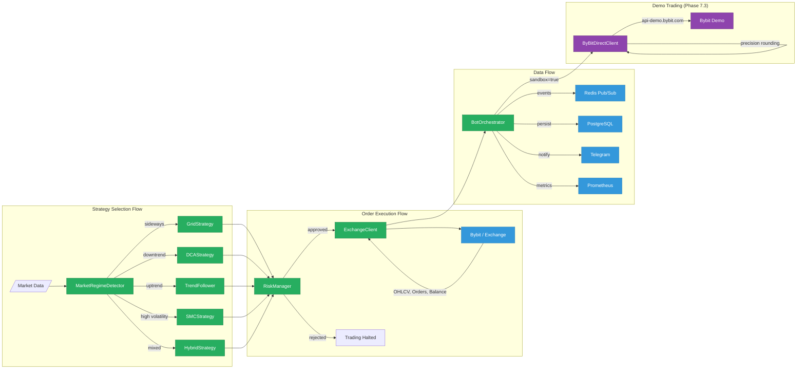

# TRADERAGENT v2.0 — Architecture & Implementation Status

**Updated:** 2026-02-16 | **Tests:** 1,206 passed (100%) | **Release:** v2.0.0 | **Demo Trading:** LIVE on Bybit

> Legend: `[DONE]` — implemented & tested | `[PARTIAL]` — in progress | `[TODO]` — not started

---

## System Architecture Diagram

```mermaid
graph TB
    subgraph UI["<b>USER INTERFACE LAYER</b>"]
        direction LR
        TG["🟢 Telegram Bot<br/><i>bot/telegram/bot.py</i><br/>860 lines<br/><b>[DONE]</b>"]
        WEBUI["🟡 Web UI Dashboard<br/><i>React + FastAPI + WebSocket</i><br/><b>[PARTIAL — Phase 4-7]</b>"]
    end

    subgraph ORCH["<b>ORCHESTRATION LAYER</b> — Phase 1 🟢"]
        direction LR
        BO["🟢 BotOrchestrator<br/><i>orchestrator/bot_orchestrator.py</i><br/>~1200 lines<br/><b>[DONE]</b>"]
        SS["🟢 StrategySelector<br/><i>orchestrator/strategy_selector.py</i><br/>475 lines<br/><b>[DONE]</b>"]
        MR["🟢 MarketRegime<br/><i>orchestrator/market_regime.py</i><br/><b>[DONE]</b>"]
        SR["🟢 StrategyRegistry<br/><i>orchestrator/strategy_registry.py</i><br/><b>[DONE]</b>"]
        EV["🟢 Events<br/><i>orchestrator/events.py</i><br/><b>[DONE]</b>"]
        HM["🟢 HealthMonitor<br/><i>orchestrator/health_monitor.py</i><br/><b>[DONE]</b>"]
    end

    subgraph STRAT["<b>STRATEGIES LAYER</b> — Phases 1-4 🟢"]
        direction TB

        subgraph GRID["Phase 2: Grid Trading 🟢"]
            direction LR
            GC["🟢 GridCalculator<br/>577 lines"]
            GOM["🟢 GridOrderManager<br/>557 lines"]
            GRM["🟢 GridRiskManager<br/>520 lines"]
            GA["🟢 GridAdapter"]
        end

        subgraph DCA["Phase 3: DCA Engine 🟢"]
            direction LR
            DSG["🟢 DCASignalGenerator<br/>638 lines"]
            DPM["🟢 DCAPositionManager<br/>678 lines"]
            DRM["🟢 DCARiskManager<br/>610 lines"]
            DE["🟢 DCAEngine<br/>440 lines"]
            DTS["🟢 DCATrailingStop"]
            DA["🟢 DCAAdapter"]
        end

        subgraph HYBRID["Phase 4: Hybrid 🟢"]
            direction LR
            HS["🟢 HybridStrategy<br/>456 lines"]
            MRD["🟢 MarketRegimeDetector<br/>650 lines"]
        end

        subgraph SMC["SMC Strategy 🟢"]
            direction LR
            SMS["🟢 SMCStrategy<br/>323 lines"]
            CZ["🟢 ConfluenceZones<br/>604 lines"]
            ES["🟢 EntrySignals<br/>676 lines"]
            MS["🟢 MarketStructure<br/>436 lines"]
            SPM["🟢 PositionManager<br/>557 lines"]
            SA["🟢 SMCAdapter"]
        end

        subgraph TF["Trend Follower 🟢"]
            direction LR
            TFS["🟢 TFStrategy<br/>468 lines"]
            MA["🟢 MarketAnalyzer<br/>316 lines"]
            EL["🟢 EntryLogic<br/>447 lines"]
            TPM["🟢 PositionManager<br/>436 lines"]
            TRM["🟢 RiskManager<br/>409 lines"]
            TFA["🟢 TFAdapter"]
        end

        BS["🟢 BaseStrategy<br/><i>strategies/base.py</i><br/>329 lines"]
    end

    subgraph CORE["<b>CORE LAYER</b>"]
        direction LR
        GE["🟢 GridEngine<br/><i>core/grid_engine.py</i><br/><b>[DONE]</b>"]
        DCE["🟢 DCAEngine<br/><i>core/dca_engine.py</i><br/><b>[DONE]</b>"]
        RM["🟢 RiskManager<br/><i>core/risk_manager.py</i><br/><b>[DONE]</b>"]
    end

    subgraph INFRA["<b>INFRASTRUCTURE LAYER</b> — Phase 5 🟢"]
        direction LR

        subgraph EXCHANGE["Exchange API 🟢"]
            EC["🟢 ExchangeClient<br/><i>api/exchange_client.py</i><br/>671 lines — CCXT"]
            BD["🟢 BybitDirectClient<br/><i>api/bybit_direct_client.py</i><br/>~900 lines — Demo Trading"]
        end

        subgraph DB["Database 🟢"]
            DBM["🟢 DatabaseManager<br/><i>database/manager.py</i><br/>401 lines"]
            MOD["🟢 Models<br/><i>database/models.py</i>"]
            MIG["🟢 Migrations<br/><i>database/migrations.py</i>"]
            BKP["🟢 Backup<br/><i>database/backup.py</i>"]
        end

        subgraph MON["Monitoring 🟢"]
            ME["🟢 MetricsExporter<br/><i>monitoring/metrics_exporter.py</i><br/>252 lines"]
            MC["🟢 MetricsCollector<br/><i>monitoring/metrics_collector.py</i>"]
            AH["🟢 AlertHandler<br/><i>monitoring/alert_handler.py</i><br/>174 lines"]
        end

        subgraph CFG["Config 🟢"]
            CM["🟢 ConfigManager<br/><i>config/manager.py</i>"]
            CS["🟢 ConfigSchemas<br/><i>config/schemas.py</i>"]
            CV["🟢 ConfigValidator<br/><i>utils/config_validator.py</i>"]
        end

        subgraph UTIL["Utils 🟢"]
            LOG["🟢 Logger<br/><i>utils/logger.py</i>"]
            CAP["🟢 CapitalManager<br/><i>utils/capital_manager.py</i>"]
            SEC["🟢 SecurityAudit<br/><i>utils/security_audit.py</i>"]
        end
    end

    subgraph TEST["<b>TESTING LAYER</b> — Phases 6-7 🟢"]
        direction LR

        subgraph UNIT["Unit Tests: 175/175 🟢"]
            UT1["Monitoring 38"]
            UT2["RiskManager 33"]
            UT3["DCAEngine 24"]
            UT4["BotOrchestrator 21"]
            UT5["GridEngine 16"]
            UT6["Config 27"]
            UT7["Events+DB+Logger 16"]
        end

        subgraph INTEG["Integration: 76/76 🟢"]
            IT1["TrendFollower Integ 37"]
            IT2["TrendFollower E2E 22"]
            IT3["Orchestration 10"]
            IT4["Module Integration 7"]
        end

        subgraph BACKT["Backtesting: 134/134 🟢"]
            BT1["Advanced Analytics 44"]
            BT2["Multi-TF 36"]
            BT3["Reports 33"]
            BT4["Multi-Strategy 31"]
            BT5["Core Backtesting 15"]
        end

        subgraph STRTESTS["Strategy Tests: 821 🟢"]
            ST1["Grid 139"]
            ST2["DCA 172"]
            ST3["SMC 118"]
            ST4["Hybrid 54"]
            ST5["TrendFollower 157"]
            ST6["Web 181"]
        end

        subgraph DEMOT["Demo Smoke Tests 🟢"]
            DST["test_demo_smoke.py<br/>Bybit Demo API"]
        end
    end

    subgraph DEVOPS["<b>DEVOPS LAYER</b> — Phase 5 🟢"]
        direction LR
        DOC["🟢 Dockerfile<br/><b>[DONE]</b>"]
        DC["🟢 docker-compose.yml<br/><b>[DONE]</b>"]
        DCM["🟢 docker-compose.monitoring.yml"]
        PROM["🟢 Prometheus<br/><i>monitoring/prometheus/</i>"]
        GRAF["🟢 Grafana<br/><i>monitoring/grafana/</i><br/>dashboard: traderagent.json"]
        ALRT["🟢 AlertManager<br/><i>monitoring/alertmanager/</i>"]
        VALD["🟢 validate_demo.py<br/><i>scripts/</i>"]
        STRT["🟢 start_demo.sh<br/><i>scripts/</i>"]
    end

    subgraph EXT["<b>EXTERNAL SERVICES</b>"]
        direction LR
        BYBIT["🔵 Bybit Exchange<br/><i>api-demo.bybit.com</i>"]
        CCXT["🔵 CCXT (150+ exchanges)"]
        PG["🔵 PostgreSQL"]
        REDIS["🔵 Redis Pub/Sub"]
        TGAPI["🔵 Telegram API"]
    end

    subgraph DONE73["<b>PHASE 7.3 — DEMO TRADING</b> 🟢"]
        direction TB
        D73A["🟢 ByBitDirectClient extended<br/><i>+400 lines: OHLCV, cancel, health_check,<br/>set_leverage, precision rounding</i>"]
        D73B["🟢 4 bots on api-demo.bybit.com<br/><i>Hybrid, Grid, DCA, TrendFollower</i>"]
        D73C["🟢 Grid orders placed & filled<br/><i>6 orders, 0.002 BTC each</i>"]
        D73D["🟢 100,000 USDT demo balance"]
    end

    subgraph TODO["<b>NOT IMPLEMENTED</b> ❌"]
        direction TB
        T74["🔴 Phase 7.4: Load/Stress Testing"]
        T8["🔴 Phase 8: Production Launch<br/><i>Security audit, gradual capital deployment</i>"]
        R2MA["🔴 ROADMAP v2.0: Multi-Account"]
        R2REP["🔴 ROADMAP v2.0: Enhanced Reporting<br/><i>PDF, email, tax</i>"]
    end

    %% Connections
    UI --> ORCH
    TG --> TGAPI
    BO --> SS
    BO --> SR
    BO --> EV
    BO --> HM
    SS --> MR
    ORCH --> STRAT
    BS --> GRID
    BS --> DCA
    BS --> HYBRID
    BS --> SMC
    BS --> TF
    STRAT --> CORE
    CORE --> INFRA
    EC --> CCXT
    EC --> BYBIT
    BD --> BYBIT
    DBM --> PG
    EV --> REDIS
    MON --> PROM
    DEVOPS --> INFRA
    TEST --> STRAT
    TEST --> CORE
    DONE73 --> BD
    DONE73 --> BYBIT

    %% Styling
    classDef done fill:#27ae60,stroke:#1e8449,color:white
    classDef partial fill:#f39c12,stroke:#d68910,color:white
    classDef todo fill:#e74c3c,stroke:#c0392b,color:white
    classDef ext fill:#3498db,stroke:#2980b9,color:white
    classDef demo fill:#8e44ad,stroke:#6c3483,color:white

    class TG,BO,SS,MR,SR,EV,HM done
    class GC,GOM,GRM,GA done
    class DSG,DPM,DRM,DE,DTS,DA done
    class HS,MRD done
    class SMS,CZ,ES,MS,SPM,SA done
    class TFS,MA,EL,TPM,TRM,TFA done
    class BS,GE,DCE,RM done
    class EC,BD,DBM,MOD,MIG,BKP done
    class CM,CS,CV,LOG,CAP,SEC done
    class ME,MC,AH done
    class DOC,DC,DCM,PROM,GRAF,ALRT,VALD,STRT done
    class UT1,UT2,UT3,UT4,UT5,UT6,UT7 done
    class IT1,IT2,IT3,IT4 done
    class BT1,BT2,BT3,BT4,BT5 done
    class ST1,ST2,ST3,ST4,ST5,ST6 done
    class DST done
    class D73A,D73B,D73C,D73D demo
    class WEBUI partial
    class T74,T8,R2MA,R2REP todo
    class BYBIT,CCXT,PG,REDIS,TGAPI ext
```



---

## Implementation Status by Phase

```
Phase 1: Architecture Foundation      ██████████████████████████████ 100%  🟢
Phase 2: Grid Trading Engine          ██████████████████████████████ 100%  🟢
Phase 3: DCA Engine                   ██████████████████████████████ 100%  🟢
Phase 4: Hybrid Strategy              ██████████████████████████████ 100%  🟢
Phase 5: Infrastructure & DevOps      ██████████████████████████████ 100%  🟢
Phase 6: Advanced Backtesting         ██████████████████████████████ 100%  🟢
Phase 7.1-7.2: Unit & Integration     ██████████████████████████████ 100%  🟢
Phase 7.3: Demo Trading (Bybit)       ██████████████████████████████ 100%  🟢 DEPLOYED!
Phase 7.4: Load/Stress Testing        ░░░░░░░░░░░░░░░░░░░░░░░░░░░░░░   0%  🔴
Phase 8: Production Launch            ░░░░░░░░░░░░░░░░░░░░░░░░░░░░░░   0%  🔴
Web UI Dashboard                      ████████████████████░░░░░░░░░░  65%  🟡
```

## Phase 7.3 — Demo Trading Details

**Deployed:** 2026-02-16 on `185.233.200.13` (Docker)
**Exchange:** `api-demo.bybit.com` (Bybit Demo Trading, production API keys)
**Balance:** 100,000 USDT (virtual)

| Bot | Symbol | Strategy | Amount/Order | Status |
|-----|--------|----------|-------------|--------|
| demo_btc_hybrid | BTC/USDT | Hybrid (Grid+DCA) | $150 (~0.002 BTC) | auto_start, orders placed & filled |
| demo_eth_grid | ETH/USDT | Grid | $30/grid | manual start |
| demo_sol_dca | SOL/USDT | DCA | $20/step | manual start |
| demo_btc_trend | BTC/USDT | Trend Follower | ATR-based | manual start |

**Key architectural decision:** CCXT `set_sandbox_mode(True)` routes to `testnet.bybit.com` (wrong endpoint, separate keys). `ByBitDirectClient` connects directly to `api-demo.bybit.com` using production API keys.

**Bugs fixed during deployment:**
- `KeyError: 'take_profit_hit'` → `tp_triggered` (DCA engine key mismatch)
- Grid qty=0 (USD→BTC conversion rounding to 0.000 with `Decimal("0.001")`)
- Bybit "Qty invalid" (qty precision must match instrument's `basePrecision`)
- Telegram Markdown parse errors (added plain-text fallback)

---

## File Statistics

| Layer | Files | Total Lines | Status |
|-------|-------|-------------|--------|
| Orchestrator | 6 | ~3,500 | 🟢 DONE |
| Strategies (Grid) | 4 | ~1,750 | 🟢 DONE |
| Strategies (DCA) | 7 | ~3,200 | 🟢 DONE |
| Strategies (Hybrid) | 3 | ~1,200 | 🟢 DONE |
| Strategies (SMC) | 6 | ~2,650 | 🟢 DONE |
| Strategies (TF) | 7 | ~2,500 | 🟢 DONE |
| Core (engines) | 3 | ~1,500 | 🟢 DONE |
| API (exchange) | 3 | ~1,600 | 🟢 DONE (+400 ByBitDirectClient) |
| Database | 5 | ~1,500 | 🟢 DONE |
| Config | 3 | ~1,000 | 🟢 DONE |
| Telegram | 1 | ~860 | 🟢 DONE |
| Monitoring | 3 | ~600 | 🟢 DONE (integrated in bot/main.py) |
| Utils | 4 | ~800 | 🟢 DONE |
| Web UI (backend) | 8 | ~2,000 | 🟡 PARTIAL |
| Web UI (frontend) | 25+ | ~5,000 | 🟡 PARTIAL |
| Scripts (deploy) | 2 | ~490 | 🟢 DONE |
| **Tests** | **40+** | **~15,000** | **🟢 1,206 passed** |
| DevOps (Docker/Monitoring) | 7 | ~500 | 🟢 DONE |

**Total: ~140 files, ~45,000+ lines of code**

## Component Dependency Map



## Remaining Work (Priority Order)

### HIGH — Complete v2.0 Plan
```
┌─────────────────────────────────────────────────────────────┐
│  1. Phase 7.4 — Load & Stress Testing                🔴    │
│     ├── High order volume simulation                       │
│     ├── Database under load                                │
│     ├── API rate limit handling                            │
│     └── Memory leak detection                              │
│                                                             │
│  2. Phase 8 — Production Launch                      🔴    │
│     ├── Security audit                                     │
│     ├── Gradual capital deployment (5% → 25% → 100%)       │
│     └── Documentation finalization                         │
└─────────────────────────────────────────────────────────────┘
```

### MEDIUM — Web UI & ROADMAP v2.0
```
┌─────────────────────────────────────────────────────────────┐
│  3. Web UI Dashboard (in progress)                   🟡    │
│     ├── ✅ FastAPI REST backend (8 endpoints)              │
│     ├── ✅ WebSocket real-time updates                     │
│     ├── ✅ React + TypeScript frontend (dark theme)        │
│     ├── 🟡 Common components (Modal, Toast, etc.)          │
│     └── 🔴 Full bot management integration                 │
│                                                             │
│  4. Multi-Account Support                            🔴    │
│  5. Enhanced Reporting (PDF, email, tax)             🔴    │
│  6. Historical Data Integration                      🔴    │
│     └── 450 CSVs (5.4 GB) → backtesting framework         │
└─────────────────────────────────────────────────────────────┘
```

### COMPLETED ✅
```
┌─────────────────────────────────────────────────────────────┐
│  ✅ Phase 1-4 — All strategies (Grid, DCA, Hybrid, TF, SMC)│
│  ✅ Phase 5 — Monitoring (Prometheus, Grafana, Alerts)      │
│  ✅ Phase 6 — Advanced Backtesting (multi-TF, analytics)    │
│  ✅ Phase 7.1-7.2 — Unit & Integration tests (1,206 passed) │
│  ✅ Phase 7.3 — Demo Trading on Bybit                       │
│     ├── ByBitDirectClient: full orchestrator compatibility  │
│     ├── 4 bots configured, grid orders placed & filled      │
│     ├── Validation script + start script                    │
│     └── Deployed on 185.233.200.13 (Docker)                │
└─────────────────────────────────────────────────────────────┘
```
